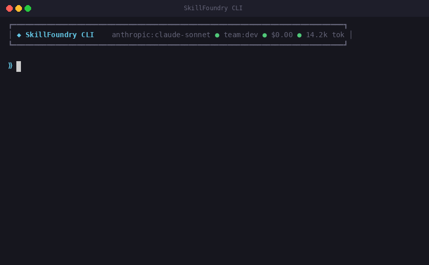

# SkillFoundry

**Turn requirements into tested, production-ready code — with quality gates your AI can't skip.**


[](https://www.npmjs.com/package/skillfoundry)


SkillFoundry is an AI engineering framework that installs 56 agents and 64 skills into your existing IDE. It adds structure, memory, and enforced quality gates to AI-assisted development — so you get production code, not prototypes. Now with runtime intelligence (message bus, agent pool, vector search), security scanners (Gitleaks, Checkov), and a native VS Code extension.

<p align="center">
  
</p>

### Why SkillFoundry?

- **Works where you already code** — Claude Code, Cursor, GitHub Copilot, OpenAI Codex, Google Gemini. No new IDE to learn.
- **Quality gates your AI can't bypass** — The Anvil runs 8 tiers of checks (correctness contracts, banned patterns, type checking, tests, security, build, scope, deploy pre-flight) between every agent handoff. Code that fails doesn't ship.
- **Persistent memory across sessions** — Decisions, errors, and patterns are stored in `memory_bank/` and recalled automatically. Your AI doesn't repeat the same mistakes.
- **PRD-first, not vibe-coding** — Every feature starts with a Product Requirements Document. The framework validates it before writing a single line of code.
- **6 AI providers, one workflow** — Anthropic, OpenAI, xAI, Google, Ollama, LM Studio. Switch providers without changing how you work.

### What's New in v2.0.68

- **Centralized Multi-Project Dashboard** — Aggregate telemetry, sessions, failures, KPIs, and trends across 60+ projects in a single SQLite database. 15 CLI subcommands, 19 API endpoints, dark-mode web UI with Chart.js visualizations.
- **KPI Trend Engine** — Daily snapshots, trend detection (improving/declining/stable), change alerts, and linear regression forecasting.
- **Auto-Remediation Engine** — 10 built-in playbooks match failure patterns to actionable fixes. Auto-apply safe remediations (dependency fixes, lint, security audit). Playbook effectiveness tracking.
- **Web Dashboard** — `sf dashboard serve` launches a zero-dependency web dashboard at http://127.0.0.1:9400 with KPI cards, charts, tabbed data tables, trend visualizations, and remediation controls.
- **206 new tests** across 8 test files (1,991 total, zero regressions).

### Quick Install

```bash
# npm (recommended)
npm install -g skillfoundry

# Homebrew (macOS)
brew install samibs/tap/skillfoundry

# One-liner (Linux/macOS)
curl -fsSL https://raw.githubusercontent.com/samibs/skillfoundry/main/scripts/install-global.sh | bash

# npx (no install needed)
npx skillfoundry init
```

### Quick Start (5 Minutes)

Five ways to install — pick what fits your workflow:

```bash
# Option A: npx (quickest — no clone needed)
cd ~/my-project
npx skillfoundry init

# Option B: npm global install (persistent CLI)
npm install -g skillfoundry
cd ~/my-project && skillfoundry init

# Option C: Homebrew (macOS)
brew install samibs/tap/skillfoundry
cd ~/my-project && skillfoundry init

# Option D: curl one-liner (Linux/macOS — installs via npm)
curl -fsSL https://raw.githubusercontent.com/samibs/skillfoundry/main/scripts/install-global.sh | bash
cd ~/my-project && skillfoundry init

# Option E: git clone (full source — for contributors and power users)
git clone https://github.com/samibs/skillfoundry.git ~/dev-tools/skillfoundry
cd ~/my-project && ~/dev-tools/skillfoundry/install.sh
```

Then use it in your AI IDE:

```bash
/prd "add user authentication"     # write requirements
/forge                             # build everything with quality gates
```

That's it. The installer copies agents and skills into your project, builds the CLI, and adds `sf` to your PATH.

<details>
<summary><strong>Windows (PowerShell)</strong></summary>

```powershell
# Option A: npx
cd C:\MyProject
npx skillfoundry init

# Option B: npm global
npm install -g skillfoundry
cd C:\MyProject; skillfoundry init

# Option C: git clone
git clone https://github.com/samibs/skillfoundry.git C:\DevTools\skillfoundry
cd C:\MyProject
C:\DevTools\skillfoundry\install.ps1
```

</details>

> **Requires Node.js v20+** for the standalone CLI. IDE skills work without Node.js.
> **Cross-platform:** Works on Linux, macOS, Windows (native, Git Bash, and WSL). Quality gates and anvil scripts auto-detect the environment.
>
> **New to SkillFoundry?** See the [Todo API example](examples/todo-api/) — a complete project built from a single PRD in two commands. For model recommendations, see [Model Compatibility](docs/model-compatibility.md).

---

## How It Works

```
 /prd "feature"          Write requirements (saved to genesis/)
       │
 /forge                  The full pipeline:
       │
       ├── Validate PRD         Are requirements complete?
       ├── Generate stories     Break into implementable units
       ├── Implement            Architect → Coder → Tester pipeline
       ├── Quality gates        The Anvil (T0-T7) + Micro-Gates (MG0-MG3)
       ├── Circuit breaker      Halt on repeated systemic errors
       ├── Security audit       OWASP scan + dependency CVEs + credential check
       ├── Harvest knowledge    Save lessons to memory_bank/
       └── Quality metrics      Track gate pass rates, trends, and industry baselines
```

Or use autonomous mode — just type what you want in plain English:

```
/autonomous on
> "add dark mode to the dashboard"    → auto-classified as FEATURE → full pipeline runs
> "the login is broken"               → auto-classified as BUG → debugger + fixer dispatched
```

---

## Two Ways to Use SkillFoundry

SkillFoundry has two independent systems. They share the same agents and philosophy, but work differently:

| | **IDE Skills** (64 skills) | **Standalone CLI** (`sf`) |
|---|---|---|
| **What it is** | Markdown instruction files your AI reads | Terminal app with its own AI connection |
| **Runs inside** | Claude Code, Copilot, Cursor, Codex, Gemini | Your terminal (any OS) |
| **Full pipeline** | `/forge`, `/go`, `/goma` (all 64 skills) | `/forge`, `/plan`, `/gates` (23 commands) |
| **Autonomous mode** | `/goma` — full autonomous with safety gates | Not available |
| **Provider switching** | Uses your IDE's provider | Built-in: 6 providers, switch at runtime |
| **Budget controls** | Not available | Per-run and monthly cost caps |
| **Persistent memory** | `/memory`, `/gohm` | `/memory`, `/lessons` |
| **Requires** | An AI coding tool | Node.js v20+ |

**Most users should start with IDE skills.** The CLI is for standalone use or when you want provider switching and budget controls.

### 1. Inside Your IDE (Recommended)

64 skills install directly into your AI coding tool. This is the full SkillFoundry experience — all agents, all orchestration, autonomous mode, everything.

| Platform | Invocation | Example |
|----------|-----------|---------|
| **Claude Code** | `/command` | `/forge`, `/go`, `/goma`, `/review` |
| **GitHub Copilot** | `@agent` in chat | `@forge`, `@coder`, `@tester` |
| **Cursor** | Auto-loaded rules | Rules activate on context |
| **OpenAI Codex** | `$command` | `$forge`, `$go`, `$review` |
| **Google Gemini** | Skill invocation | `forge`, `go`, `review` |

```bash
# Full pipeline — works in Claude Code, Copilot, Cursor, Codex, Gemini
/prd "add user authentication"     # create requirements
/forge                             # validate → implement → gate → audit → harvest
/goma                              # autonomous mode: just describe what you want

# Individual agents
/coder                             # code implementation
/review                            # code review
/security audit                    # security scan
/memory recall "auth"              # recall lessons from previous sessions
```

### 2. The Standalone CLI (`sf`)

A separate terminal app with its own AI connection. Useful for provider switching, budget controls, and working outside an IDE. Has 23 native commands (not all 64 skills).

```
 ┏━━━━━━━━━━━━━━━━━━━━━━━━━━━━━━━━━━━━━━━━━━━━━━━━━━━━━━━━━━━━━━━━━━━━━━━━━━━━━━┓
 │ ◆ SkillFoundry CLI    anthropic:claude-sonnet ● team:dev ● $0.00 ● 14.2k tok │
 └──────────────────────────────────────────────────────────────────────────────────┘

 │ ▸ sf:coder> I'll help you add dark mode. Let me look at the existing
 │             dashboard code...
 │
 │   ▸ bash    npm test                ✓ 0.8s
 │   ◉ read    src/styles/theme.ts     ✓ 0.1s
 │   ◈ write   src/styles/dark.ts      ✓ 0.1s
 │
 │   ● routed:high ● 142 in / 387 out ● $0.0045

 ╭──────────────────────────────────────────────────────────────────────────────────╮
 │ ⟫ looks good, now review for accessibility issues                               │
 ╰──────────────────────────────────────────────────────────────────────────────────╯

 │ ▸ sf:review> I'll review the dark mode implementation for accessibility...
```

---

## Features

### Multi-Agent Teams

Summon a team once, and messages auto-route to the best agent for the job. No manual switching.

```
/team dev          → coder, tester, fixer, review, debugger
/team security     → security, review, tester
/team fullstack    → architect, coder, tester, review, debugger, docs
/team ops          → devops, sre, performance, security
/team ship         → coder, tester, review, release, docs
/team custom coder review tester    → build your own roster
```

Routing is keyword-based with weighted patterns — no extra LLM calls, deterministic and fast.

### Quality Gates (The Anvil + Micro-Gates)

Every handoff passes through a 7-tier quality pipeline plus AI-powered micro-gates:

```
 ◆ The Anvil

   ┣━ T0  ◉  Correctness Contract           0.1s
   ┣━ T1  ◉  Banned Patterns & Syntax       0.2s
   ┣━ T2  ◉  Type Check                     1.1s
   ┣━ T3  ◉  Tests                          3.4s
   ┣━ T4  ◉  Security Scan                  0.8s
   ┣━ T5  ◉  Build                          2.1s
   ┗━ T6  ◉  Scope Validation               0.3s

   ┌──────────────────────────────────────────┐
   │ ✓ VERDICT: PASS  6P 0F 0W 1S (8.0s)    │
   └──────────────────────────────────────────┘

 ◆ Micro-Gates (per story)

   ┣━ MG0   ◉  AC Validation (static)       PASS
   ┣━ MG1   ◉  Security Review (AI)         PASS
   ┣━ MG1.5 ◉  Test Documentation (AI)      PASS
   ┣━ MG2   ◉  Standards Review (AI)        PASS
   ┗━ MG3   ◉  Cross-Story Review (AI)      PASS  (advisory)
```

Micro-gates are lightweight reviews at pipeline handoff points. MG0 validates acceptance criteria are objectively testable (static, no AI). MG1 (security) and MG2 (standards) run after each story — if they fail, the fixer is triggered automatically. MG1.5 checks test documentation quality (re-triggers tester on failure). MG3 reviews cross-story consistency before the TEMPER phase (advisory only).

### PRD-First Development

Every non-trivial feature starts with a Product Requirements Document. No PRD = no implementation.

```
/prd "user authentication with OAuth2"     → Creates genesis/2026-02-23-auth.md
/go                                        → Validates PRDs → generates stories → implements
/forge                                     → Real AI pipeline: PRDs → stories → implement → gates → report
/forge --dry-run                           → Read-only scan (no AI execution)
```

### Multi-Provider Support

Switch between 6 AI providers without changing your workflow:

| Provider | Env Variable | Default Model |
|----------|-------------|---------------|
| Anthropic Claude | `ANTHROPIC_API_KEY` | claude-sonnet-4 |
| OpenAI | `OPENAI_API_KEY` | gpt-4o |
| xAI Grok | `XAI_API_KEY` | grok-3 |
| Google Gemini | `GOOGLE_API_KEY` | gemini-2.5-flash |
| Ollama (local) | `OLLAMA_BASE_URL` | llama3.1 |
| LM Studio (local) | `LMSTUDIO_BASE_URL` | qwen2.5-coder-7b |

```bash
sf setup --provider anthropic --key sk-ant-...   # persistent storage
/provider set openai                              # switch at runtime
/provider set lmstudio                            # use LM Studio locally
```

### Budget Controls

Per-run and monthly cost caps with real-time tracking:

```toml
# .skillfoundry/config.toml
[budget]
monthly_limit_usd = 50.00
per_run_limit_usd = 2.00
```

Token usage and cost are shown live in the header during streaming.

### Structured Logging

Every pipeline run and interactive session produces structured JSONL logs for troubleshooting. One JSON object per line — parseable, grep-friendly, and timestamped.

```
.skillfoundry/logs/
├── session.log                   # Rolling log for interactive mode (last 1000 lines)
├── forge-20260305-abc123.log     # Per-pipeline-run log
└── ...                           # Auto-cleanup keeps last 20
```

```jsonl
{"ts":"2026-03-05T12:07:14.123Z","level":"INFO","category":"pipeline","event":"phase_start","data":{"phase":"FORGE"}}
{"ts":"2026-03-05T12:07:15.456Z","level":"ERROR","category":"provider","event":"connection_error","data":{"provider":"openai","error":"ECONNREFUSED"}}
{"ts":"2026-03-05T12:07:16.789Z","level":"WARN","category":"provider","event":"retry_attempt","data":{"attempt":2,"delayMs":1000}}
```

Configure the log level in `.skillfoundry/config.toml`:

```toml
log_level = "info"   # debug | info | warn | error
```

Set to `debug` for per-turn token counts and tool call tracing. Default `info` captures phase transitions, gate results, and errors.

### Pipeline Resume

`/forge` tracks story completion and resumes where it left off. If a run is interrupted or partially fails, re-running `/forge` skips already-completed stories and implements only the remaining ones.

```
Implementing 2 stories (3 already done, skipped)
```

Stories are marked `status: DONE` in their `.md` files after successful completion, including passing micro-gates and fixer loops.

### Local-First Development

Use local models (Ollama, LM Studio) for free, offline AI — with automatic fallback to cloud when needed.

```toml
# .skillfoundry/config.toml
[routing]
route_local_first = true        # Enable local-first routing
local_provider = "ollama"       # or "lmstudio"
local_model = "llama3.1"        # your preferred local model
context_window = 0              # 0 = auto-detect from model
```

**What happens when enabled:**
- Simple tasks (docs, formatting, boilerplate) route to your local model (free)
- Complex tasks (architecture, security, refactoring) route to cloud (paid)
- Context compaction automatically fits prompts within local model limits (4K-32K)
- If the local model is offline, cloud fallback activates with a warning

```
/cost                    → Shows local vs cloud token breakdown + estimated savings
/config route_local_first true   → Enable routing
/provider set lmstudio           → Switch to LM Studio
```

### Smart Output Compression

Tool outputs are automatically compressed before reaching the AI context — saving 60-90% of tokens on common operations. No configuration needed.

| Command | Before | After | Savings |
|---------|--------|-------|---------|
| `git status` | ~2,000 tokens | ~400 tokens | -80% |
| `git push/commit` | ~1,600 tokens | ~120 tokens | -92% |
| `npm test` (all pass) | ~25,000 tokens | ~2,500 tokens | -90% |
| `tsc --noEmit` | ~8,000 tokens | ~1,600 tokens | -80% |
| `npm install` | ~3,000 tokens | ~450 tokens | -85% |

The compressor detects command type via regex (<1ms), applies type-specific filtering (strip noise, group errors, deduplicate, show failures only), and falls back to standard truncation for unrecognized commands. Full output is preserved on errors for debugging context.

### Tool System

The AI executes tools with permission controls and dangerous command blocking:

| Tool | Icon | Purpose |
|------|------|---------|
| `bash` | `▸` | Run shell commands |
| `read` | `◉` | Read files with line numbers |
| `write` | `◈` | Create or overwrite files |
| `glob` | `✶` | Find files by pattern |
| `grep` | `≣` | Search file contents |
| `debug_start` | | Start a debug session (Node.js) |
| `debug_breakpoint` | | Set/remove/list breakpoints |
| `debug_inspect` | | Inspect scope, callstack, variables |
| `debug_evaluate` | | Evaluate expressions in paused frame |
| `debug_step` | | Step over/into/out/continue/pause |
| `debug_stop` | | Terminate debug session |

Permission modes: `auto` (read auto-approved, write asks), `ask` (prompt every time), `trusted` (allow all), `deny` (block all).

### Interactive Debugger

AI agents can debug your code with real breakpoints, variable inspection, and expression evaluation — using the Chrome DevTools Protocol (CDP) over WebSocket.

```
/debug src/server.ts              # Start a debug session, paused at entry
/debug src/server.ts:42           # Start and set breakpoint at line 42
/debug test src/auth.test.ts      # Debug a test file via test runner
```

The debugger:
- Spawns `node --inspect-brk=0` with source map support
- Connects via a custom MinimalWebSocket (Node 20 compatible, no polyfills)
- Enforces singleton sessions (one at a time) with configurable timeout (default 60s, max 5min)
- Localhost-only WebSocket connections (security hardened)
- SIGTERM → SIGKILL escalation for process cleanup

### Persistent Memory (Lessons Learned)

SkillFoundry remembers across sessions. Every decision, error, and pattern is stored in `memory_bank/` using append-only JSONL with weighted relevance ranking. Agents query this memory automatically — so they don't repeat mistakes or forget conventions.

```
memory_bank/
├── knowledge/
│   ├── bootstrap.jsonl          Pre-seeded framework knowledge
│   ├── facts.jsonl              Verified technical facts
│   ├── decisions.jsonl          Design decisions with rationale
│   ├── errors.jsonl             Error patterns and their solutions
│   └── preferences.jsonl        User preferences and conventions
├── relationships/
│   ├── knowledge-graph.json     Node/edge relationship graph
│   └── lineage.json             Correction chains and lineage
└── retrieval/
    ├── query-cache.json         Recent query cache
    └── weights.json             Weight adjustment history
```

**Automatic pipeline harvesting:** Every `/forge` run automatically writes knowledge entries to `memory_bank/knowledge/*.jsonl` — run summaries, failed story errors, micro-gate findings, and gate verdicts. No manual invocation needed.

**In the CLI:**
```
/memory stats                              Show memory bank statistics
/memory recall "authentication"            Find relevant lessons
```

**In any platform (Claude Code, Cursor, etc.):**
```
/gohm                                     Harvest lessons from current session
/memory recall "JWT"                       Recall what you learned about JWT
```

**Via shell scripts:**
```bash
scripts/memory.sh remember "Use RS256 for JWT, never HS256" decision
scripts/memory.sh recall "database migration"
scripts/memory.sh status
```

**Weight system:** Entries start at 0.5 weight. Validated-by-test entries gain +0.2. Retrieved-and-used entries gain +0.1. Corrected entries drop to 0.3 while the correction starts at 0.7. Higher weight = higher retrieval priority.

### Knowledge Sync (Cross-Project Learning)

Knowledge doesn't stay locked in one project. The sync daemon pushes lessons to a central GitHub repository and pulls global lessons back — so patterns learned in project A are available in project B.

```bash
# One-time setup: connect a global knowledge repo
scripts/knowledge-sync.sh init https://github.com/you/dev-memory.git

# Start the background sync daemon (syncs every 5 minutes)
scripts/knowledge-sync.sh start

# Manual sync
scripts/knowledge-sync.sh sync

# Promote recurring error patterns to global lessons
scripts/knowledge-sync.sh promote

# Register a new project for cross-project sync
scripts/knowledge-sync.sh register /path/to/project
```

**Harvest engine:** After a session, `scripts/harvest.sh` extracts decisions, errors, and patterns from one or all registered projects into the central `memory_bank/knowledge/` universal files. Entries that repeat 3+ times across projects get auto-promoted to global lessons.

### Autonomous Mode

Toggle autonomous mode and stop typing commands — just describe what you want in plain English. SkillFoundry classifies your intent and routes to the correct pipeline automatically.

```
/autonomous on                             Enable autonomous mode
```

Once active, every message is classified and routed:

| You Type | Classified As | Pipeline |
|----------|--------------|----------|
| "add dark mode to the dashboard" | FEATURE | Architect → Coder → Tester → Gate-Keeper |
| "the login is broken" | BUG | Debugger → Fixer → Tester |
| "clean up the auth module" | REFACTOR | Architect → Coder → Tester |
| "how does the payment flow work?" | QUESTION | Explain (read-only, no file changes) |
| "deploy to staging" | OPS | Ship / DevOps pipeline |
| "remember: we use RS256 for JWT" | MEMORY | Write to memory_bank/ |

Complex features automatically get a PRD generated in `genesis/`, stories broken out, and the full agent pipeline executed — with quality gates between every handoff.

```
/autonomous off                            Back to manual command mode
/autonomous status                         Check if autonomous mode is active
```

### VS Code Extension

SkillFoundry ships a native VS Code extension that brings quality gates, telemetry, and forge runs directly into your editor — no terminal switching required.

```
┌──────────┬──────────────────────────────┬───────────────┐
│ Explorer │ Editor                       │ SF Sidebar    │
│          │                              │               │
│          │  src/auth.ts                 │ ◆ Dashboard   │
│          │  ─────────────────           │  Pass Rate 94%│
│          │  1 │ import { hash }         │  Last Forge ✓ │
│          │  2 │ // TODO: add rate  ⚠    │  CVEs: 2 high │
│          │    │ ▸ Run T1 (Patterns)     │               │
│          │    │ ▸ Run T4 (Security)     │ ◆ Gate Status │
│          │                              │  T0-T7 results│
│          │                              │               │
│          │                              │ ◆ Forge       │
│          │                              │  Phase: TEMPER│
│          │                              │  Story: 5/8   │
├──────────┴──────────────────────────────┴───────────────┤
│ SF: 94% gates │ sf:coder │ $0.12               Output   │
└─────────────────────────────────────────────────────────┘
```

**Features:**
- **Sidebar dashboard** — gate pass rate, security findings, telemetry trends, dependency CVEs
- **Inline diagnostics** — gate findings appear as squiggly underlines (like ESLint)
- **CodeLens** — "Run T3 (Tests)" above test files, "Run T1/T4" above source files
- **Command palette** — 12 commands: gate, forge, metrics, report, memory recall, PRD, hooks, benchmark
- **Forge monitor** — real-time phase progress in sidebar, runs in integrated terminal
- **Status bar** — gate pass rate with color coding, click to open metrics
- **File watcher** — auto-refreshes dashboard when telemetry updates

```bash
# From VS Code Marketplace (recommended)
# Search "SkillFoundry" in the Extensions panel, or:
code --install-extension skillfoundry.skillfoundry

# Or build from source
cd skillfoundry-vscode && npm install && npm run build
code --install-extension skillfoundry-0.1.0.vsix
```

### Agent Evolution

Agents improve over time through a debate-implement-iterate loop:

```bash
scripts/evolve.sh debate                   Agents debate improvements
scripts/evolve.sh implement --auto-fix     Apply winning proposals
scripts/evolve.sh iterate                  Refine through multiple rounds
scripts/evolve.sh run                      Full evolution cycle
```

---

## Command Reference

### sf CLI Commands (23 native)

These work inside the `sf` terminal app:

| Command | Purpose |
|---------|---------|
| `/help` | List available commands |
| `/setup` | Configure API keys |
| `/status` | Session info, provider, budget |
| `/team <name>` | Summon a team (dev, security, ops, fullstack, ship) |
| `/agent <name>` | Activate a single agent (coder, review, tester, etc.) |
| `/plan <task>` | Generate an implementation plan |
| `/apply [plan-id]` | Execute a plan with quality gates |
| `/gates [target]` | Run The Anvil quality gates (T1-T7) |
| `/gate <t0-t7\|all>` | Run a single quality gate or all gates |
| `/forge` | Pipeline: validate PRDs → implement → gate → report |
| `/forge --dry-run` | Read-only scan without execution |
| `/provider [set <name>]` | Switch AI provider |
| `/model [model-name]` | List or switch the AI model |
| `/cost` | Token usage and cost report |
| `/memory [stats\|recall]` | Query or record knowledge |
| `/config [key] [value]` | View or edit configuration |
| `/metrics [--window N]` | Quality metrics dashboard with trends |
| `/report [--format md\|json]` | Generate exportable quality report |
| `/benchmark` | Compare quality against industry baselines |
| `/hook install\|uninstall\|status` | Manage git hook integration for quality gates |
| `/runtime` | Runtime intelligence status (message bus, agent pool, vector store) |
| `/prd review <path>` | Score a PRD on 4 dimensions with actionable feedback |
| `/lessons` | Query and manage knowledge bank entries |

### IDE Skills (63 — Claude Code, Copilot, Cursor, Codex, Gemini)

These work inside your AI coding tool, not in the `sf` CLI:

| Skill | Purpose |
|-------|---------|
| `/forge` | Full 6-phase pipeline (Ignite → Forge → Temper → Inspect → Remember → Debrief) |
| `/go` | PRD-first orchestrator: validate → stories → implement |
| `/goma` | Autonomous mode: classify intent, route to pipeline, execute |
| `/prd "idea"` | Create a Product Requirements Document |
| `/coder` | Code implementation agent |
| `/tester` | Test generation and validation |
| `/review` | Code review |
| `/security` | Security audit (OWASP, credentials, banned patterns) |
| `/architect` | System design and architecture |
| `/debug` | Interactive debugger (breakpoints, scope, evaluate) |
| `/layer-check` | Three-layer validation (DB → Backend → Frontend) |
| `/memory` | Knowledge management |
| `/gohm` | Harvest lessons from current session |
| `/autonomous` | Toggle autonomous developer loop |
| *...and 50 more* | See `/help` in your IDE for the full list |

> **Note:** `/forge` exists in both systems but they are different implementations. The IDE skill orchestrates sub-agents; the CLI command runs a self-contained pipeline.

---

## Supported Platforms

The framework generates platform-specific configurations during install. Each platform gets the same 64 skills adapted to its native format:

| Platform | What Gets Installed | How to Invoke | Notes |
|----------|-------------------|---------------|-------|
| **Claude Code** | `.claude/commands/` (64 skills) | `/command` | Slash commands in Claude Code CLI |
| **GitHub Copilot** | `.copilot/custom-agents/` (60 agents) | `@agent` in chat | Custom agents in Copilot Chat |
| **Cursor** | `.cursor/rules/` (60 rules) | Auto-loaded | Rules activate based on context |
| **OpenAI Codex** | `.agents/skills/` (64 skills) | `$command` | Dollar-prefix commands in Codex CLI |
| **Google Gemini** | `.gemini/skills/` (64 skills) | Skill invocation | Available in Gemini sessions |

Install multiple platforms at once:

```bash
./install.sh --platform="claude,cursor,copilot"    # Linux/macOS
./install.ps1 -Platform "claude,cursor,copilot"     # Windows
```

**All 64 skills work identically across platforms.** The installer translates agent contracts from `agents/` into each platform's native format. When you update the framework, `update.sh` / `update.ps1` regenerates all platform files.

---

## Architecture

```
skillfoundry/
├── sf_cli/                  Interactive CLI (Node.js + React/Ink)
│   ├── src/core/            Provider adapters, tools, permissions, gates, micro-gates, budget, compaction, output compression, debugger (CDP), message bus, agent pool, embedding service, vector store, weight learner, dependency scanner, report generator, gitleaks scanner, checkov scanner, semantic search, PRD scorer
│   ├── src/components/      Terminal UI: Header, Input, Message, GateTimeline, ...
│   ├── src/commands/        Slash command handlers (/team, /agent, /plan, ...)
│   └── src/hooks/           Session state and streaming hooks
├── skillfoundry-vscode/     VS Code Extension (bridge to sf_cli)
│   ├── src/extension.ts     Activation, lifecycle, file watcher
│   ├── src/bridge.ts        Thin adapter calling sf_cli core modules
│   ├── src/providers/       Dashboard, gate timeline, dependency CVE tree, forge monitor, diagnostics, CodeLens, status bar
│   └── src/commands/        Gate, forge, memory, PRD, metrics, report commands
├── agents/                  56 agent contracts and orchestration protocols
├── genesis/                 PRD templates and your feature documents
├── memory_bank/             Persistent knowledge across sessions
│   ├── knowledge/           facts, decisions, errors, preferences (JSONL)
│   └── relationships/       Knowledge graph and lineage tracking
├── scripts/                 Shell tooling (works without the CLI)
│   ├── env-preflight.sh     Environment audit → JSON (interpreters, deps, .env safety)
│   ├── auto-harvest-cron.sh Cron sweep: harvest all registered projects on schedule
│   ├── setup-auto-harvest.sh One-command installer for cron + Claude Code hooks
│   ├── session-monitor.sh   Real-time agent behavior monitor (PostToolUse hook)
│   ├── memory.sh            Remember, recall, correct knowledge
│   ├── harvest.sh           Extract lessons from projects
│   ├── knowledge-sync.sh    Sync daemon for cross-project learning
│   ├── anvil.sh             Quality gate runner
│   ├── evolve.sh            Agent evolution (debate → implement → iterate)
│   ├── session-init.sh      Session startup (pull knowledge, start daemon)
│   └── session-close.sh     Session teardown (harvest, sync, stop daemon)
├── compliance/              GDPR, HIPAA, SOC2 profiles and automated checks
├── observability/           Audit logging, metrics collection, trace viewer
│
│  Platform skill files (generated by installer):
├── .claude/commands/        Claude Code (64 skills)
├── .copilot/custom-agents/  GitHub Copilot (60 agents)
├── .cursor/rules/           Cursor (60 rules)
├── .agents/skills/          OpenAI Codex (64 skills)
└── .gemini/skills/          Google Gemini (64 skills)
```

---

## Pipeline Details

```
                    ┌─────────────┐
                    │   /prd      │  Write requirements
                    └──────┬──────┘
                           │
                    ┌──────▼──────┐
                    │   /go       │  Validate → generate stories → implement
                    └──────┬──────┘
                           │
              ┌────────────┼────────────┐
              │            │            │
        ┌─────▼─────┐ ┌───▼───┐ ┌─────▼─────┐
        │ Architect  │ │ Coder │ │  Tester   │  Agent pipeline
        └─────┬─────┘ └───┬───┘ └─────┬─────┘
              │            │            │
              └────────────┼────────────┘
                           │
                    ┌──────▼──────┐
                    │ Micro-Gates │  MG1 security + MG2 standards
                    └──────┬──────┘
                           │
                    ┌──────▼──────┐
                    │  The Anvil  │  T1-T6 quality gates
                    └──────┬──────┘
                           │
                    ┌──────▼──────┐
                    │  /security  │  OWASP scan + credential check
                    └──────┬──────┘
                           │
                    ┌──────▼──────┐
                    │   /gohm     │  Harvest lessons → memory_bank/
                    └──────┬──────┘
                           │
                    ┌──────▼──────┐
                    │ knowledge   │  Sync to global repo (optional)
                    │    sync     │  Lessons available in all projects
                    └─────────────┘
```

`/forge` runs this entire pipeline in one command. It discovers PRDs, generates stories, implements each story with the agentic tool-use loop, runs micro-gates (MG1 security + MG2 standards per story, MG3 cross-story review), runs T1-T6 quality gates (with auto-fixer retries), persists run metadata, and automatically harvests knowledge entries (run summaries, errors, gate verdicts) to `memory_bank/knowledge/*.jsonl`. Use `/forge --dry-run` for a read-only scan.

---

## Updating

After pulling the latest framework:

```bash
# Linux/macOS
cd ~/dev-tools/skillfoundry && git pull
./update.sh ~/my-project              # Updates skills + rebuilds CLI

# Windows
cd C:\DevTools\skillfoundry; git pull
.\update.ps1 -Project C:\MyProject    # Updates skills + rebuilds CLI
```

Update all registered projects at once:

```bash
./update.sh --all                      # Linux/macOS
.\update.ps1 -All                      # Windows
```

---

## Documentation

| Document | Description |
|----------|-------------|
| [User Guide](docs/USER-GUIDE-v1.9.0.16.md) | Full CLI usage guide |
| [Quick Reference](docs/QUICK-REFERENCE.md) | Command cheat sheet |
| [Agent Evolution](docs/AGENT-EVOLUTION.md) | How agents evolve and improve |
| [API Reference](docs/API-REFERENCE.md) | CLI internals and extension points |
| [Persistent Memory](memory_bank/README.md) | Memory bank schema and usage |
| [Autonomous Mode](docs/AUTONOMOUS-EXECUTION.md) | Autonomous developer loop details |
| [Knowledge Sync](docs/PERSISTENT-MEMORY-IMPLEMENTATION.md) | Cross-project knowledge sync |
| [Anti-Patterns](docs/ANTI_PATTERNS_DEPTH.md) | Security anti-patterns to avoid |
| [Model Compatibility](docs/model-compatibility.md) | Which AI models work, tier recommendations |
| [Troubleshooting](docs/TROUBLESHOOTING.md) | Common issues and fixes |
| [Changelog](CHANGELOG.md) | Version history |
| [Todo API Example](examples/todo-api/) | Complete example project built from a single PRD |

---

## Contributing

Contributions welcome. See [CONTRIBUTING.md](CONTRIBUTING.md) for setup, workflow, and code standards.

Short version: fork, branch, write tests, open a PR against `main`.

---

## License

MIT License. See [LICENSE](LICENSE).
