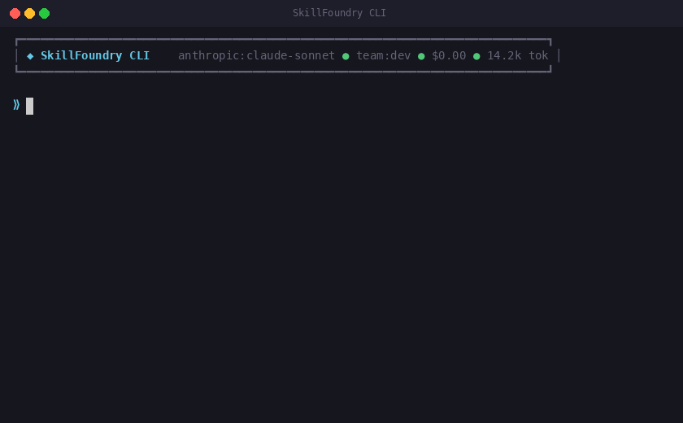

# SkillFoundry

**Turn requirements into tested, production-ready code — with quality gates your AI can't skip.**


[](https://www.npmjs.com/package/skillfoundry)


SkillFoundry is an AI engineering framework that works two ways: as a **standalone CLI** (`sf`) with its own AI connection, or as a **skill layer inside your existing IDE** (Claude Code, Cursor, Copilot, Codex, Gemini, Grok Build). Either way you get the same thing — quality gates your AI can't skip, a PRD-first pipeline that enforces structure before writing code, and persistent memory that learns from every session. 23 real tool agents, 130+ skills, 6 AI providers, a tree-sitter Code Map pre-flight that reads your codebase before the AI writes, Semgrep SAST, PRD linting, cross-platform parity detection, and a knowledge base built from 2,792 artifacts across 49 projects.

<p align="center">
  
</p>

### Why SkillFoundry?

- **Standalone or IDE — your choice** — Run `sf` as an independent CLI with your own API key, no IDE required. Or install the skills into Claude Code, Cursor, Copilot, Codex, or Gemini and work inside the tool you already use. Same agents, same gates, same pipeline either way.
- **Quality gates your AI can't bypass** — The Anvil runs 8 tiers of checks (correctness contracts, banned patterns, type checking, tests, security, build, scope, deploy pre-flight) between every agent handoff. Code that fails doesn't ship.
- **Adversarial threat modeling built in** — The Specter engine runs a red-team loop on every pipeline. It generates attack vectors with CVSS metadata and simulates exploits before your code leaves the pipeline.
- **PRD-first, not vibe-coding** — Every feature starts with a Product Requirements Document. The framework validates it before writing a single line of code.
- **Persistent memory across sessions** — Decisions, errors, and patterns stored in `memory_bank/` with semantic vector search. Your AI doesn't repeat the same mistakes.
- **6 AI providers, budget controls** — Anthropic, OpenAI, xAI, Google, Ollama, LM Studio. Per-run and monthly cost caps built in. Switch providers without changing how you work.

### What's New in v5.26.0

**Domain Expert Synthesis — project-scoped, review-only domain reviewers**

When you build for a specialized non-IT field (legal, accounting, real-estate, medical), generic output is often *correct but not professionally right* — the vocabulary or register a practitioner would never sign. SkillFoundry now synthesizes a **review-only domain reviewer** for that field, on demand.

- **Three ways it's detected.** An agent self-flags while producing specialized non-IT content; the same domain corrected 3+ times is surfaced; or a PRD declares `domains:` up front.
- **Review-only, never advisory.** Reviewers check terminology, register, and way-of-working, and cite a knowledge pack or flag it unverified — they never give advice or make legal/financial/medical determinations.
- **Earns its way into the framework.** A reviewer synthesized across 3+ projects is promoted from project-local to framework-shared, so every future project inherits it.
- **Never recreates IT skills.** IT domains are auto-filtered — only genuine non-IT gaps get a reviewer.

Full breakdown in the CHANGELOG under `[5.26.0]`.

#### Previous: Security & Robustness Hardening (v5.25.0)

A full adversarial audit of the codebase, then remediation — RCE/exfil paths closed, per-project memory isolation, and gates that fail closed. Details in the CHANGELOG under `[5.25.0]`.

#### Previous: Injection Resistance & Prompt Discipline (v5.24.0)

Instructions embedded in PRDs, diffs, memory, and tool results are treated as **data, not commands** (gate-tampering is BLOCK); plus no-process-theater output, graduated relevance-based recall, a stop-at-first-match `/auto` cascade, and a trigger+anti-trigger skill-description standard.

#### Previous: Verification Layer (v5.23.0)

`/verify` runs the gates against **any** agent's diff (not just `/forge` output) for a `PASS / WARN / BLOCK` verdict; `/prd-lint` reasons over requirements for contradictions and gaps before code exists; the `/tester` gate adds property-based testing across generated inputs.

#### Previous: Refinement Pass (v5.22.x)

- ~12,000 lines of repeated prompt ceremony removed; `/gosm`·`/goma`·`/blitz` collapsed to thin `/go` aliases; Anvil tiers moved to the A-namespace (ending the T-number collision with the CLI gates); several correctness/consistency fixes. v5.22.1 reconciled skill/agent counts to verifiable ground truth.

#### Previous: Codebase Agent Wiki (v5.21.0)

- `/docs wiki` — a repo-wide, agent-facing wiki generator (Phase 7 of the Documentation Codifier), grounded in source + git evidence, with surgical change-aware updates. Inspired by [langchain-ai/openwiki](https://github.com/langchain-ai/openwiki).

#### Previous: Autonomous Loop Engine (v5.20.0)

- Ralph Loop protocol (`_ralph-loop-protocol.md`), self-prompt quality protocol (`_self-prompt-protocol.md`), `/improve` continuous-improvement command, Loop Mode in the autonomous protocol, and reflection loop-back. The agent finds the work, does the work, judges its own output, and stops when there is nothing left.

#### Previous: Structural Trust & Production Resilience (v5.19.0)

- Multi-user state isolation (`.claude/local/` vs `.claude/shared/`), convention discovery, `/hotfix` emergency pathway, evaluator calibration, durable audit trail, global profile resolution, stack confidence hard block.

#### Previous: Web Security Checker (v5.18.0)

- `/web-security-check` — 10 check groups (TLS, headers, cookies, DNS, info leakage, redirects, ports, WHOIS, deps, WAF). BLOCKER/WARN/INFO severity. Mandatory gate in `/production-orchestrator` for public-facing URLs.

#### Previous: Codebase Comprehension Pre-Flight (v5.17.0)

- `sf_codemap` MCP tool (tree-sitter Code Map): API contract surface, import graph, DB/layer map. `/preflight` command. Wired into `/forge` IGNITE phase. Pure-WASM, advisory (never blocks).

#### Previous: Grok Platform & Provider Refresh (v5.16.0)

- xAI Grok Build added as the 6th install platform. `.grok/skills/` with `AGENTS.md`. Updated xAI provider to `grok-4.3` with real pricing. Platform count `5` → `6`.

#### Previous: Coding Discipline Protocol (v5.15.0)

- Framework-wide behavioral guardrail (`agents/_coding-discipline.md`): Think-Before-Coding, Simplicity-First (scoped), Surgical Changes, Goal-Driven Execution.

#### Previous: Pipeline Quality (v5.13.0)

- `/guardloop` skill, `failure-scan.sh` + `guardloop-harvest.sh` hooks, `agents/_guardloop-rules.md` adaptive rules file. 10 patterns tracked, CRITICAL patterns auto-promoted after 3 hits.

#### Previous: FolderFlow — Story State Machine (v5.11.0)

- `/go` + `/layer-check` integration, story checkbox reconciler, folder state machine (todo/in-progress/blocked/done), JSON artifact handlers. 83-case test suite.

#### Previous: Test Cartographer — `/test-map` Skill (v5.10.0)

- `/test-map` skill for automated test documentation across all 5 platforms with three-tier classification (HIGH/MEDIUM/BASELINE), deep optimization for GitHub Copilot with the Claude model (~160 lines of constitutional rules), and config-protect fix for `.claude/` allowlist entries.
- **Forge progress notification** — `withProgress` notification wraps the forge terminal lifetime, cancellable from the notification. ForgeMonitor sidebar continues tracking phases live via `forge-state.json`.

#### Previous: Adversarial Intelligence (v5.7.0)

**Local Vector Memory + Specter Security Engine + Red Team Researcher Skill**

- **Local Vector Memory** — File-based cosine-similarity vector store with multi-provider embedding (Ollama → Transformers → OpenAI). `TransformersEmbeddingProvider` (@xenova/transformers) is always available as a zero-dependency local fallback. `harvestRunMemory` now semantically indexes every pipeline run. Hybrid recall combines keyword + semantic search.
- **Specter Security Engine** — Adversarial threat modeling phase injected into every pipeline between INSPECT and DEBRIEF (now 9 phases). `SpecterEngine` runs an agentic red-team loop, generates attack vectors with severity/CVSS metadata, and executes safe simulations against an allowlisted command set. Registered as the 62nd agent (`specter`, FULL category).
- **Red Team Researcher Skill** (`/red-team-researcher`) — Senior offensive/defensive security researcher persona. Thinks in attacker primitives (source → sink → impact), grades severity by reachability, uses structured finding format. Ships with 6 domain reference files: code review, web/API, cloud infrastructure, threat modeling, reporting, and blue team/incident triage.

#### Previous: Parallel Dispatch + NL Cron (v5.6.0)

- Parallel Dispatch Engine (`sf_parallel_analyze`), Natural Language Cron (`sf_cron_compile`).

#### Previous: Hermes Intelligence (v5.5.0)

- LLM Context Summarizer (Haiku-powered), Memory Nudge System (13 tools monitored), FTS5 Session Search (sf_memory_search).

#### Previous: Token Optimization (v5.4.0)

- Response Optimizer (JSON compaction, concise mode, output truncation), Token Tracker (SQLite-persisted), sf_token_report tool.

#### Previous: Hook Enforcement (v5.3.0)

- GateGuard (force-read-before-edit), Config Protection (30+ linter/formatter configs), Session Quality Report, Session Lifecycle hooks.

#### Previous: Multi-Tenant Security (v5.2.0)

- Auto-injected security stories (SEC-001–SEC-006), Multi-Tenant Isolation Gate (7 checks), 10 deviation patterns (MT-001–MT-010).

#### Previous: Harness Engineering + Learning Intelligence (v5.0–5.1)

- 22 tool agents, Secret Guard, Deviation Enforcer (161 rules), Import Validator, Correction Loop, Health Scores, harness engineering upgrade.

```jsonc
// Token printed to console on first boot — also at data/.api-token
"mcpServers": {
  "skillfoundry": {
    "url": "http://localhost:9877/mcp/sse",
    "headers": { "Authorization": "Bearer <token>" }
  }
}
```

### Quick Install

```bash
# Standalone CLI — no IDE needed
npm install -g skillfoundry
sf setup                           # interactive: choose provider, paste API key
sf forge                           # run the full pipeline from your terminal

# Or add skills to your existing IDE
npx skillfoundry init              # installs skills into Claude Code / Cursor / Copilot

# Homebrew (macOS)
brew install samibs/tap/skillfoundry

# One-liner (Linux/macOS)
curl -fsSL https://raw.githubusercontent.com/samibs/skillfoundry/main/scripts/install-global.sh | bash
```

### Quick Start (5 Minutes)

**1. Install & Setup**
```bash
npm install -g skillfoundry
sf setup                           # Pick provider, paste API key
```

**2. Create a PRD**
```bash
/prd "add user authentication"     # Describe your feature
```

**3. Forge Production Code**
```bash
/forge                             # Validate, implement, and test automatically
```

> **Using an IDE?** Run `npx skillfoundry init` in your project to add these skills directly to Claude Code, Cursor, or Copilot.


<details>
<summary><strong>Windows (PowerShell)</strong></summary>

```powershell
# Option A: npx
cd C:\MyProject
npx skillfoundry init

# Option B: npm global
npm install -g skillfoundry
cd C:\MyProject; skillfoundry init

# Option C: git clone
git clone https://github.com/samibs/skillfoundry.git C:\DevTools\skillfoundry
cd C:\MyProject
C:\DevTools\skillfoundry\install.ps1
```

</details>

> **Requires Node.js v20+** for the standalone CLI. IDE skills work without Node.js.
> **Cross-platform:** Works on Linux, macOS, Windows (native, Git Bash, and WSL). Quality gates and anvil scripts auto-detect the environment.
>
> **New to SkillFoundry?** See the [Todo API example](examples/todo-api/) — a complete project built from a single PRD in two commands. For model recommendations, see [Model Compatibility](docs/model-compatibility.md).

---

## How It Works

```
 /prd "feature"          Write requirements (saved to genesis/)
       │
 /forge                  The full pipeline:
       │
       ├── Validate PRD         Are requirements complete?
       ├── Generate stories     Break into implementable units
       ├── Implement            Architect → Coder → Tester pipeline
       ├── Quality gates        The Anvil (T0-T7) + Micro-Gates (MG0-MG3)
       ├── Circuit breaker      Halt on repeated systemic errors
       ├── Security audit       OWASP scan + dependency CVEs + credential check
       ├── Harvest knowledge    Save lessons to memory_bank/
       └── Quality metrics      Track gate pass rates, trends, and industry baselines
```

Or use autonomous mode — just type what you want in plain English:

```
/autonomous on
> "add dark mode to the dashboard"    → auto-classified as FEATURE → full pipeline runs
> "the login is broken"               → auto-classified as BUG → debugger + fixer dispatched
```

---

## Two Ways to Use SkillFoundry

SkillFoundry has two independent systems. They share the same agents and philosophy, but work differently:

| | **Standalone CLI** (`sf`) | **IDE Skills** (109 skills) |
|---|---|---|
| **What it is** | Terminal app with its own AI connection | Markdown instruction files your AI reads |
| **Runs inside** | Your terminal (any OS, no IDE needed) | Claude Code, Copilot, Cursor, Codex, Gemini, Grok Build |
| **Setup** | `sf setup` — interactive wizard, paste API key | `skillfoundry init` — copies skills into your project |
| **Full pipeline** | `sf forge`, `sf plan`, `sf gates` (23 commands) | `/forge`, `/go`, `/goma` (all 109 skills) |
| **Autonomous mode** | Not available | `/goma` — full autonomous with safety gates |
| **Provider switching** | Built-in: 6 providers, switch at runtime | Uses your IDE's provider |
| **Budget controls** | Per-run and monthly cost caps | Not available |
| **Persistent memory** | `/memory`, `/lessons` | `/memory`, `/gohm` |
| **Requires** | Node.js v20+ | An AI coding tool |

**No IDE? Start with `sf`.** `npm install -g skillfoundry && sf setup` and you're running the full pipeline in under a minute. Already using Cursor or Claude Code? Install the skills on top and get the extra 84 skills, autonomous mode, and full orchestration.

### 1. Inside Your IDE (Recommended)

109 skills install directly into your AI coding tool. This is the full SkillFoundry experience — all agents, all orchestration, autonomous mode, everything.

| Platform | Invocation | Example |
|----------|-----------|---------|
| **Claude Code** | `/command` | `/forge`, `/go`, `/goma`, `/review` |
| **GitHub Copilot** | `@agent` in chat | `@forge`, `@coder`, `@tester` |
| **Cursor** | Auto-loaded rules | Rules activate on context |
| **OpenAI Codex** | `$command` | `$forge`, `$go`, `$review` |
| **Google Gemini** | Skill invocation | `forge`, `go`, `review` |

```bash
# Full pipeline — works in Claude Code, Copilot, Cursor, Codex, Gemini, Grok Build
/prd "add user authentication"     # create requirements
/forge                             # validate → implement → gate → audit → harvest
/goma                              # autonomous mode: just describe what you want

# Individual agents
/coder                             # code implementation
/review                            # code review
/security audit                    # security scan
/memory recall "auth"              # recall lessons from previous sessions
```

### 2. The Standalone CLI (`sf`)

A separate terminal app with its own AI connection. Useful for provider switching, budget controls, and working outside an IDE. Has 23 native commands (not all 109 skills).

```
 ┏━━━━━━━━━━━━━━━━━━━━━━━━━━━━━━━━━━━━━━━━━━━━━━━━━━━━━━━━━━━━━━━━━━━━━━━━━━━━━━┓
 │ ◆ SkillFoundry CLI    anthropic:claude-sonnet ● team:dev ● $0.00 ● 14.2k tok │
 └──────────────────────────────────────────────────────────────────────────────────┘

 │ ▸ sf:coder> I'll help you add dark mode. Let me look at the existing
 │             dashboard code...
 │
 │   ▸ bash    npm test                ✓ 0.8s
 │   ◉ read    src/styles/theme.ts     ✓ 0.1s
 │   ◈ write   src/styles/dark.ts      ✓ 0.1s
 │
 │   ● routed:high ● 142 in / 387 out ● $0.0045

 ╭──────────────────────────────────────────────────────────────────────────────────╮
 │ ⟫ looks good, now review for accessibility issues                               │
 ╰──────────────────────────────────────────────────────────────────────────────────╯

 │ ▸ sf:review> I'll review the dark mode implementation for accessibility...
```

---

## Features

### Multi-Agent Teams

Summon a team once, and messages auto-route to the best agent for the job. No manual switching.

```
/team dev          → coder, tester, fixer, review, debugger
/team security     → security, review, tester
/team fullstack    → architect, coder, tester, review, debugger, docs
/team ops          → devops, sre, performance, security
/team ship         → coder, tester, review, release, docs
/team custom coder review tester    → build your own roster
```

Routing is keyword-based with weighted patterns — no extra LLM calls, deterministic and fast.

### Quality Gates (The Anvil + Micro-Gates)

Every handoff passes through a 7-tier quality pipeline plus AI-powered micro-gates:

```
 ◆ The Anvil

   ┣━ T0  ◉  Correctness Contract           0.1s
   ┣━ T1  ◉  Banned Patterns & Syntax       0.2s
   ┣━ T2  ◉  Type Check                     1.1s
   ┣━ T3  ◉  Tests                          3.4s
   ┣━ T4  ◉  Security Scan                  0.8s
   ┣━ T5  ◉  Build                          2.1s
   ┗━ T6  ◉  Scope Validation               0.3s

   ┌──────────────────────────────────────────┐
   │ ✓ VERDICT: PASS  6P 0F 0W 1S (8.0s)    │
   └──────────────────────────────────────────┘

 ◆ Micro-Gates (per story)

   ┣━ MG0   ◉  AC Validation (static)       PASS
   ┣━ MG1   ◉  Security Review (AI)         PASS
   ┣━ MG1.5 ◉  Test Documentation (AI)      PASS
   ┣━ MG2   ◉  Standards Review (AI)        PASS
   ┗━ MG3   ◉  Cross-Story Review (AI)      PASS  (advisory)
```

Micro-gates are lightweight reviews at pipeline handoff points. MG0 validates acceptance criteria are objectively testable (static, no AI). MG1 (security) and MG2 (standards) run after each story — if they fail, the fixer is triggered automatically. MG1.5 checks test documentation quality (re-triggers tester on failure). MG3 reviews cross-story consistency before the TEMPER phase (advisory only).

### PRD-First Development

Every non-trivial feature starts with a Product Requirements Document. No PRD = no implementation.

```
/prd "user authentication with OAuth2"     → Creates genesis/2026-02-23-auth.md
/go                                        → Validates PRDs → generates stories → implements
/forge                                     → Real AI pipeline: PRDs → stories → implement → gates → report
/forge --dry-run                           → Read-only scan (no AI execution)
```

### Multi-Provider Support

Switch between 6 AI providers without changing your workflow:

| Provider | Env Variable | Default Model |
|----------|-------------|---------------|
| Anthropic Claude | `ANTHROPIC_API_KEY` | claude-sonnet-4 |
| OpenAI | `OPENAI_API_KEY` | gpt-4o |
| xAI Grok | `XAI_API_KEY` | grok-4.3 |
| Google Gemini | `GOOGLE_API_KEY` | gemini-2.5-flash |
| Ollama (local) | `OLLAMA_BASE_URL` | llama3.1 |
| LM Studio (local) | `LMSTUDIO_BASE_URL` | qwen2.5-coder-7b |

```bash
sf setup --provider anthropic --key sk-ant-...   # persistent storage
/provider set openai                              # switch at runtime
/provider set lmstudio                            # use LM Studio locally
```

### Budget Controls

Per-run and monthly cost caps with real-time tracking:

```toml
# .skillfoundry/config.toml
[budget]
monthly_limit_usd = 50.00
per_run_limit_usd = 2.00
```

Token usage and cost are shown live in the header during streaming.

### Structured Logging

Every pipeline run and interactive session produces structured JSONL logs for troubleshooting. One JSON object per line — parseable, grep-friendly, and timestamped.

```
.skillfoundry/logs/
├── session.log                   # Rolling log for interactive mode (last 1000 lines)
├── forge-20260305-abc123.log     # Per-pipeline-run log
└── ...                           # Auto-cleanup keeps last 20
```

```jsonl
{"ts":"2026-03-05T12:07:14.123Z","level":"INFO","category":"pipeline","event":"phase_start","data":{"phase":"FORGE"}}
{"ts":"2026-03-05T12:07:15.456Z","level":"ERROR","category":"provider","event":"connection_error","data":{"provider":"openai","error":"ECONNREFUSED"}}
{"ts":"2026-03-05T12:07:16.789Z","level":"WARN","category":"provider","event":"retry_attempt","data":{"attempt":2,"delayMs":1000}}
```

Configure the log level in `.skillfoundry/config.toml`:

```toml
log_level = "info"   # debug | info | warn | error
```

Set to `debug` for per-turn token counts and tool call tracing. Default `info` captures phase transitions, gate results, and errors.

### Pipeline Resume

`/forge` tracks story completion and resumes where it left off. If a run is interrupted or partially fails, re-running `/forge` skips already-completed stories and implements only the remaining ones.

```
Implementing 2 stories (3 already done, skipped)
```

Stories are marked `status: DONE` in their `.md` files after successful completion, including passing micro-gates and fixer loops.

### Local-First Development

Use local models (Ollama, LM Studio) for free, offline AI — with automatic fallback to cloud when needed.

```toml
# .skillfoundry/config.toml
[routing]
route_local_first = true        # Enable local-first routing
local_provider = "ollama"       # or "lmstudio"
local_model = "llama3.1"        # your preferred local model
context_window = 0              # 0 = auto-detect from model
```

**What happens when enabled:**
- Simple tasks (docs, formatting, boilerplate) route to your local model (free)
- Complex tasks (architecture, security, refactoring) route to cloud (paid)
- Context compaction automatically fits prompts within local model limits (4K-32K)
- If the local model is offline, cloud fallback activates with a warning

```
/cost                    → Shows local vs cloud token breakdown + estimated savings
/config route_local_first true   → Enable routing
/provider set lmstudio           → Switch to LM Studio
```

### Smart Output Compression

Tool outputs are automatically compressed before reaching the AI context — saving 60-90% of tokens on common operations. No configuration needed.

| Command | Before | After | Savings |
|---------|--------|-------|---------|
| `git status` | ~2,000 tokens | ~400 tokens | -80% |
| `git push/commit` | ~1,600 tokens | ~120 tokens | -92% |
| `npm test` (all pass) | ~25,000 tokens | ~2,500 tokens | -90% |
| `tsc --noEmit` | ~8,000 tokens | ~1,600 tokens | -80% |
| `npm install` | ~3,000 tokens | ~450 tokens | -85% |

The compressor detects command type via regex (<1ms), applies type-specific filtering (strip noise, group errors, deduplicate, show failures only), and falls back to standard truncation for unrecognized commands. Full output is preserved on errors for debugging context.

### Tool System

The AI executes tools with permission controls and dangerous command blocking:

| Tool | Icon | Purpose |
|------|------|---------|
| `bash` | `▸` | Run shell commands |
| `read` | `◉` | Read files with line numbers |
| `write` | `◈` | Create or overwrite files |
| `glob` | `✶` | Find files by pattern |
| `grep` | `≣` | Search file contents |
| `debug_start` | | Start a debug session (Node.js) |
| `debug_breakpoint` | | Set/remove/list breakpoints |
| `debug_inspect` | | Inspect scope, callstack, variables |
| `debug_evaluate` | | Evaluate expressions in paused frame |
| `debug_step` | | Step over/into/out/continue/pause |
| `debug_stop` | | Terminate debug session |

Permission modes: `auto` (read auto-approved, write asks), `ask` (prompt every time), `trusted` (allow all), `deny` (block all).

### Codebase Pre-Flight (Code Map)

Before the AI changes existing code, SkillFoundry builds a **Code Map** of your repo so it works from facts, not guesses.

```bash
/preflight              # build/refresh the Code Map and print a summary
/preflight query <name> # look up a symbol or file and its connections
/preflight diff-impact  # blast radius of your current changes
```

| What it maps | Why it matters |
|--------------|----------------|
| API contract surface (`endpoints[]`) | The AI calls real endpoints with real shapes — no invented routes |
| Import + call graph | Unresolved imports caught before build; impact analysis on changes |
| DB models + layer tags | Knows what's database / backend / frontend / shared |

- Backed by tree-sitter (TS/JS + Python); cached at `.skillfoundry/code-map.json` and refreshed incrementally.
- Runs automatically in `/forge` and `/go`, feeding `sf_contract_check` and `sf_import_validator`. Advisory — never blocks a run.
- Explore it visually in the dashboard's **Code Map** tab (search, layer view, diff-impact overlay).

### Interactive Debugger

AI agents can debug your code with real breakpoints, variable inspection, and expression evaluation — using the Chrome DevTools Protocol (CDP) over WebSocket.

```
/debug src/server.ts              # Start a debug session, paused at entry
/debug src/server.ts:42           # Start and set breakpoint at line 42
/debug test src/auth.test.ts      # Debug a test file via test runner
```

The debugger:
- Spawns `node --inspect-brk=0` with source map support
- Connects via a custom MinimalWebSocket (Node 20 compatible, no polyfills)
- Enforces singleton sessions (one at a time) with configurable timeout (default 60s, max 5min)
- Localhost-only WebSocket connections (security hardened)
- SIGTERM → SIGKILL escalation for process cleanup

### Persistent Memory (Lessons Learned)

SkillFoundry remembers across sessions. Every decision, error, and pattern is stored in `memory_bank/` using append-only JSONL with weighted relevance ranking. Agents query this memory automatically — so they don't repeat mistakes or forget conventions.

```
memory_bank/
├── knowledge/
│   ├── bootstrap.jsonl          Pre-seeded framework knowledge
│   ├── facts.jsonl              Verified technical facts
│   ├── decisions.jsonl          Design decisions with rationale
│   ├── errors.jsonl             Error patterns and their solutions
│   └── preferences.jsonl        User preferences and conventions
├── relationships/
│   ├── knowledge-graph.json     Node/edge relationship graph
│   └── lineage.json             Correction chains and lineage
└── retrieval/
    ├── query-cache.json         Recent query cache
    └── weights.json             Weight adjustment history
```

**Automatic pipeline harvesting:** Every `/forge` run automatically writes knowledge entries to `memory_bank/knowledge/*.jsonl` — run summaries, failed story errors, micro-gate findings, and gate verdicts. No manual invocation needed.

**In the CLI:**
```
/memory stats                              Show memory bank statistics
/memory recall "authentication"            Find relevant lessons
```

**In any platform (Claude Code, Cursor, etc.):**
```
/gohm                                     Harvest lessons from current session
/memory recall "JWT"                       Recall what you learned about JWT
```

**Via shell scripts:**
```bash
scripts/memory.sh remember "Use RS256 for JWT, never HS256" decision
scripts/memory.sh recall "database migration"
scripts/memory.sh status
```

**Weight system:** Entries start at 0.5 weight. Validated-by-test entries gain +0.2. Retrieved-and-used entries gain +0.1. Corrected entries drop to 0.3 while the correction starts at 0.7. Higher weight = higher retrieval priority.

### Knowledge Sync (Cross-Project Learning)

Knowledge doesn't stay locked in one project. The sync daemon pushes lessons to a central GitHub repository and pulls global lessons back — so patterns learned in project A are available in project B.

```bash
# One-time setup: connect a global knowledge repo
scripts/knowledge-sync.sh init https://github.com/you/dev-memory.git

# Start the background sync daemon (syncs every 5 minutes)
scripts/knowledge-sync.sh start

# Manual sync
scripts/knowledge-sync.sh sync

# Promote recurring error patterns to global lessons
scripts/knowledge-sync.sh promote

# Register a new project for cross-project sync
scripts/knowledge-sync.sh register /path/to/project
```

**Harvest engine:** After a session, `scripts/harvest.sh` extracts decisions, errors, and patterns from one or all registered projects into the central `memory_bank/knowledge/` universal files. Entries that repeat 3+ times across projects get auto-promoted to global lessons.

### Autonomous Mode

Toggle autonomous mode and stop typing commands — just describe what you want in plain English. SkillFoundry classifies your intent and routes to the correct pipeline automatically.

```
/autonomous on                             Enable autonomous mode
```

Once active, every message is classified and routed:

| You Type | Classified As | Pipeline |
|----------|--------------|----------|
| "add dark mode to the dashboard" | FEATURE | Architect → Coder → Tester → Gate-Keeper |
| "the login is broken" | BUG | Debugger → Fixer → Tester |
| "clean up the auth module" | REFACTOR | Architect → Coder → Tester |
| "how does the payment flow work?" | QUESTION | Explain (read-only, no file changes) |
| "deploy to staging" | OPS | Ship / DevOps pipeline |
| "remember: we use RS256 for JWT" | MEMORY | Write to memory_bank/ |

Complex features automatically get a PRD generated in `genesis/`, stories broken out, and the full agent pipeline executed — with quality gates between every handoff.

```
/autonomous off                            Back to manual command mode
/autonomous status                         Check if autonomous mode is active
```

### VS Code Extension (v1.3.0)

SkillFoundry ships a native VS Code extension that works as a complete standalone shell — setup wizard, CLI check, quality gates, telemetry, and forge runs directly in your editor.

```
┌──────────┬──────────────────────────────┬───────────────┐
│ Explorer │ Editor                       │ SF Sidebar    │
│          │                              │               │
│          │  src/auth.ts                 │ ◆ Dashboard   │
│          │  ─────────────────           │  Pass Rate 94%│
│          │  1 │ import { hash }         │  Last Forge ✓ │
│          │  2 │ // TODO: add rate  ⚠    │  CVEs: 2 high │
│          │    │ ▸ Run T1 (Patterns)     │               │
│          │    │ ▸ Run T4 (Security)     │ ◆ Gate Status │
│          │                              │  T0-T7 results│
│          │                              │               │
│          │                              │ ◆ Forge       │
│          │                              │  Phase: SPECTER│
│          │                              │  Story: 5/8   │
├──────────┴──────────────────────────────┴───────────────┤
│ SF: 94% gates │ sf:coder │ $0.12               Output   │
└─────────────────────────────────────────────────────────┘
```

**Features (v1.3.0):**
- **Setup wizard** (`SkillFoundry: Setup`) — On first open, prompts for provider and API key. Key stored in VS Code SecretStorage; never written to disk. Auto-detects missing install and offers setup.
- **sf CLI check** — Detects whether `sf` is on PATH at activation. If missing, offers `npm install -g skillfoundry` via integrated terminal in one click.
- **Forge progress** — `withProgress` notification stays open for the duration of the forge run, cancellable. ForgeMonitor sidebar tracks phases live via `forge-state.json`.
- **Sidebar dashboard** — gate pass rate, security findings, telemetry trends, dependency CVEs
- **Inline diagnostics** — gate findings appear as squiggly underlines (like ESLint)
- **CodeLens** — "Run T3 (Tests)" above test files, "Run T1/T4" above source files
- **Command palette** — 13 commands: setup, gate, forge, metrics, report, memory recall, PRD, hooks, benchmark
- **Status bar** — gate pass rate with color coding, click to open metrics
- **File watcher** — auto-refreshes dashboard when telemetry updates

```bash
# From VS Code Marketplace (recommended)
# Search "SkillFoundry" in the Extensions panel, or:
code --install-extension skillfoundry.skillfoundry

# Or build from source
cd skillfoundry-vscode && npm install && npm run build
code --install-extension skillfoundry-1.3.0.vsix
```

### Agent Evolution

Agents improve over time through a debate-implement-iterate loop:

```bash
scripts/evolve.sh debate                   Agents debate improvements
scripts/evolve.sh implement --auto-fix     Apply winning proposals
scripts/evolve.sh iterate                  Refine through multiple rounds
scripts/evolve.sh run                      Full evolution cycle
```

### Domain Experts (v5.26.0)

Building for a specialized non-IT field (law, accounting, real estate, medical)? Generic output there is often *correct but not professionally right* — the vocabulary or register a practitioner would never sign. SkillFoundry synthesizes a **review-only domain reviewer** for the field, on demand.

```bash
/domain expert "French legal contract drafting"   # synthesize a reviewer + knowledge pack
/domain experts                                    # list reviewers in this project
```

- **Detected three ways** — an agent self-flags a gap, the same domain corrected 3+ times, or a PRD declares `domains:`.
- **Review-only** — checks terminology, register, and way-of-working, cites a pack or flags it unverified; **never gives advice or makes determinations**.
- **Earns its way in** — a reviewer synthesized across 3+ projects is promoted to the framework, so every future project inherits it.
- **Never recreates IT skills** — IT domains are auto-filtered.

Full guide: [docs/DOMAIN-EXPERTS.md](docs/DOMAIN-EXPERTS.md).

### Dead-Code & Duplication Pruning

`/prune` finds and safely removes **dead code and duplicate code** in any codebase — backed by a real detection engine, not guesswork.

```bash
/prune                    # scan: unused imports/exports + copy-paste blocks
/prune deadcode --fix     # remove fully-unused imports (the safe subset only)
/prune duplicates         # locate copy-paste blocks to extract into shared code
```

- **Safe by default** — only fully-unused import lines are auto-removed. Unused-export candidates and duplicate blocks are *reported for review*, never blind-deleted (an export may be an entry point; de-duplication is a refactor, not a deletion).
- **Dependency-free** — window-matching + import analysis for JS/TS/Python; `--deep` also runs `jscpd`/`knip`/`depcheck` when installed. Skips `node_modules`, `dist`, `build`, vendored and generated code.

---

## Command Reference

### sf CLI Commands (23 native)

These work inside the `sf` terminal app:

| Command | Purpose |
|---------|---------|
| `/help` | List available commands |
| `/setup` | Configure API keys |
| `/status` | Session info, provider, budget |
| `/team <name>` | Summon a team (dev, security, ops, fullstack, ship) |
| `/agent <name>` | Activate a single agent (coder, review, tester, etc.) |
| `/plan <task>` | Generate an implementation plan |
| `/apply [plan-id]` | Execute a plan with quality gates |
| `/gates [target]` | Run The Anvil quality gates (T1-T7) |
| `/gate <t0-t7\|all>` | Run a single quality gate or all gates |
| `/forge` | Pipeline: validate PRDs → implement → gate → report |
| `/forge --dry-run` | Read-only scan without execution |
| `/provider [set <name>]` | Switch AI provider |
| `/model [model-name]` | List or switch the AI model |
| `/cost` | Token usage and cost report |
| `/memory [stats\|recall]` | Query or record knowledge |
| `/config [key] [value]` | View or edit configuration |
| `/metrics [--window N]` | Quality metrics dashboard with trends |
| `/report [--format md\|json]` | Generate exportable quality report |
| `/benchmark` | Compare quality against industry baselines |
| `/hook install\|uninstall\|status` | Manage git hook integration for quality gates |
| `/runtime` | Runtime intelligence status (message bus, agent pool, vector store) |
| `/prd review <path>` | Score a PRD on 4 dimensions with actionable feedback |
| `/lessons` | Query and manage knowledge bank entries |

### IDE Skills (108 — Claude Code, Copilot, Cursor, Codex, Gemini, Grok Build)

These work inside your AI coding tool, not in the `sf` CLI:

| Skill | Purpose |
|-------|---------|
| `/forge` | Full 6-phase pipeline (Ignite → Forge → Temper → Inspect → Remember → Debrief) |
| `/go` | PRD-first orchestrator: validate → stories → implement |
| `/goma` | Autonomous mode: classify intent, route to pipeline, execute |
| `/prd "idea"` | Create a Product Requirements Document |
| `/coder` | Code implementation agent |
| `/tester` | Test generation and validation |
| `/review` | Code review |
| `/security` | Security audit (OWASP, credentials, banned patterns) |
| `/web-security-check` | Pre-production gate: TLS, headers, cookies, DNS, leakage, redirects |
| `/architect` | System design and architecture |
| `/debug` | Interactive debugger (breakpoints, scope, evaluate) |
| `/layer-check` | Three-layer validation (DB → Backend → Frontend) |
| `/memory` | Knowledge management |
| `/gohm` | Harvest lessons from current session |
| `/autonomous` | Toggle autonomous developer loop |
| *...and 93 more* | See `/help` in your IDE for the full list |

> **Note:** `/forge` exists in both systems but they are different implementations. The IDE skill orchestrates sub-agents; the CLI command runs a self-contained pipeline.

---

## Supported Platforms

The framework generates platform-specific configurations during install. Each platform gets the same skills adapted to its native format:

| Platform | What Gets Installed | How to Invoke | Notes |
|----------|-------------------|---------------|-------|
| **Claude Code** | `.claude/commands/` (109 skills) | `/command` | Slash commands in Claude Code CLI |
| **GitHub Copilot** | `.copilot/custom-agents/` (108 agents) | `@agent` in chat | Custom agents in Copilot Chat |
| **Cursor** | `.cursor/rules/` (108 rules) | Auto-loaded | Rules activate based on context |
| **OpenAI Codex** | `.agents/skills/` (109 skills) | `$command` | Dollar-prefix commands in Codex CLI |
| **Google Gemini** | `.gemini/skills/` (109 skills) | Skill invocation | Available in Gemini sessions |

Install multiple platforms at once:

```bash
./install.sh --platform="claude,cursor,copilot"    # Linux/macOS
./install.ps1 -Platform "claude,cursor,copilot"     # Windows
```

**Skills work identically across platforms.** The installer translates agent contracts from `agents/` into each platform's native format. When you update the framework, `update.sh` / `update.ps1` regenerates all platform files.

---

## Architecture

```
skillfoundry/
├── sf_cli/                  Interactive CLI (Node.js + React/Ink)
│   ├── src/core/            Provider adapters, tools, permissions, gates, micro-gates, budget, compaction, output compression, debugger (CDP), message bus, agent pool, embedding service, vector store, weight learner, dependency scanner, report generator, gitleaks scanner, checkov scanner, semantic search, PRD scorer
│   ├── src/components/      Terminal UI: Header, Input, Message, GateTimeline, ...
│   ├── src/commands/        Slash command handlers (/team, /agent, /plan, ...)
│   └── src/hooks/           Session state and streaming hooks
├── skillfoundry-vscode/     VS Code Extension (bridge to sf_cli)
│   ├── src/extension.ts     Activation, lifecycle, file watcher
│   ├── src/bridge.ts        Thin adapter calling sf_cli core modules
│   ├── src/providers/       Dashboard, gate timeline, dependency CVE tree, forge monitor, diagnostics, CodeLens, status bar
│   └── src/commands/        Gate, forge, memory, PRD, metrics, report commands
├── agents/                  56 agent contracts and orchestration protocols
├── genesis/                 PRD templates and your feature documents
├── memory_bank/             Persistent knowledge across sessions
│   ├── knowledge/           facts, decisions, errors, preferences (JSONL)
│   └── relationships/       Knowledge graph and lineage tracking
├── scripts/                 Shell tooling (works without the CLI)
│   ├── env-preflight.sh     Environment audit → JSON (interpreters, deps, .env safety)
│   ├── auto-harvest-cron.sh Cron sweep: harvest all registered projects on schedule
│   ├── setup-auto-harvest.sh One-command installer for cron + Claude Code hooks
│   ├── session-monitor.sh   Real-time agent behavior monitor (PostToolUse hook)
│   ├── memory.sh            Remember, recall, correct knowledge
│   ├── harvest.sh           Extract lessons from projects
│   ├── knowledge-sync.sh    Sync daemon for cross-project learning
│   ├── anvil.sh             Quality gate runner
│   ├── evolve.sh            Agent evolution (debate → implement → iterate)
│   ├── session-init.sh      Session startup (pull knowledge, start daemon)
│   └── session-close.sh     Session teardown (harvest, sync, stop daemon)
├── compliance/              GDPR, HIPAA, SOC2 profiles and automated checks
├── observability/           Audit logging, metrics collection, trace viewer
│
│  Platform skill files (generated by installer):
├── .claude/commands/        Claude Code (109 skills)
├── .copilot/custom-agents/  GitHub Copilot (108 agents)
├── .cursor/rules/           Cursor (108 rules)
├── .agents/skills/          OpenAI Codex (109 skills)
└── .gemini/skills/          Google Gemini (109 skills)
```

---

## Pipeline Details

```
                    ┌─────────────┐
                    │   /prd      │  Write requirements
                    └──────┬──────┘
                           │
                    ┌──────▼──────┐
                    │   /go       │  Validate → generate stories → implement
                    └──────┬──────┘
                           │
              ┌────────────┼────────────┐
              │            │            │
        ┌─────▼─────┐ ┌───▼───┐ ┌─────▼─────┐
        │ Architect  │ │ Coder │ │  Tester   │  Agent pipeline
        └─────┬─────┘ └───┬───┘ └─────┬─────┘
              │            │            │
              └────────────┼────────────┘
                           │
                    ┌──────▼──────┐
                    │ Micro-Gates │  MG1 security + MG2 standards
                    └──────┬──────┘
                           │
                    ┌──────▼──────┐
                    │  The Anvil  │  T1-T6 quality gates
                    └──────┬──────┘
                           │
                    ┌──────▼──────┐
                    │  /security  │  OWASP scan + credential check
                    └──────┬──────┘
                           │
                    ┌──────▼──────┐
                    │   /gohm     │  Harvest lessons → memory_bank/
                    └──────┬──────┘
                           │
                    ┌──────▼──────┐
                    │ knowledge   │  Sync to global repo (optional)
                    │    sync     │  Lessons available in all projects
                    └─────────────┘
```

`/forge` runs this entire pipeline in one command. It discovers PRDs, generates stories, implements each story with the agentic tool-use loop, runs micro-gates (MG1 security + MG2 standards per story, MG3 cross-story review), runs T1-T6 quality gates (with auto-fixer retries), persists run metadata, and automatically harvests knowledge entries (run summaries, errors, gate verdicts) to `memory_bank/knowledge/*.jsonl`. Use `/forge --dry-run` for a read-only scan.

---

## Updating

After pulling the latest framework:

```bash
# Linux/macOS
cd ~/dev-tools/skillfoundry && git pull
./update.sh ~/my-project              # Updates skills + rebuilds CLI

# Windows
cd C:\DevTools\skillfoundry; git pull
.\update.ps1 -Project C:\MyProject    # Updates skills + rebuilds CLI
```

Update all registered projects at once:

```bash
./update.sh --all                      # Linux/macOS
.\update.ps1 -All                      # Windows
```

---

## Documentation

| Document | Description |
|----------|-------------|
| [User Guide](docs/USER-GUIDE-v1.9.0.16.md) | Full CLI usage guide |
| [Quick Reference](docs/QUICK-REFERENCE.md) | Command cheat sheet |
| [Agent Evolution](docs/AGENT-EVOLUTION.md) | How agents evolve and improve |
| [API Reference](docs/API-REFERENCE.md) | CLI internals and extension points |
| [Persistent Memory](memory_bank/README.md) | Memory bank schema and usage |
| [Autonomous Mode](docs/AUTONOMOUS-EXECUTION.md) | Autonomous developer loop details |
| [Knowledge Sync](docs/PERSISTENT-MEMORY-IMPLEMENTATION.md) | Cross-project knowledge sync |
| [Anti-Patterns](docs/ANTI_PATTERNS_DEPTH.md) | Security anti-patterns to avoid |
| [Model Compatibility](docs/model-compatibility.md) | Which AI models work, tier recommendations |
| [Troubleshooting](docs/TROUBLESHOOTING.md) | Common issues and fixes |
| [Changelog](CHANGELOG.md) | Version history |
| [Todo API Example](examples/todo-api/) | Complete example project built from a single PRD |

---

## Contributing

Contributions welcome. See [CONTRIBUTING.md](CONTRIBUTING.md) for setup, workflow, and code standards.

Short version: fork, branch, write tests, open a PR against `main`.

---

## License

MIT License. See [LICENSE](LICENSE).
