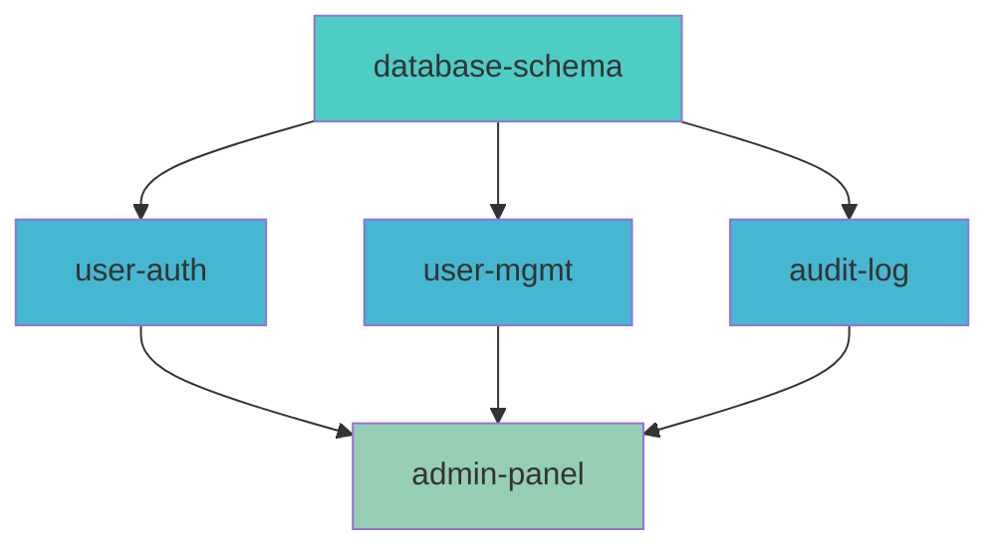

# Inter-PRD Dependency Management

> **CORE FRAMEWORK MODULE**
> This module defines how PRDs can depend on each other and how dependencies are resolved.

---

## Overview

Inter-PRD dependencies enable:
- Feature sequencing across PRDs
- Shared foundation detection
- Cross-PRD impact analysis
- Intelligent execution ordering

---

## Dependency Declaration

### In PRD Metadata

```markdown
---
prd_id: user-authentication
title: User Authentication System
created: 2026-01-20
status: APPROVED

dependencies:
  requires: []                    # PRDs that must complete first
  recommends: []                  # PRDs that should complete first
  blocks: [user-profile, admin-panel]  # PRDs that depend on this
  shared_with: []                 # PRDs that share components

tags: [auth, security, core]
---
```

### Dependency Types

| Type | Meaning | Enforcement |
|------|---------|-------------|
| `requires` | **Must** complete before this PRD can start | Hard block |
| `recommends` | **Should** complete first, but not mandatory | Soft warning |
| `blocks` | This PRD **blocks** others from starting | Informational |
| `shared_with` | PRDs that share components with this one | Coordination |

---

## Dependency Graph

### Building the Graph

```
1. Scan genesis/ for all PRD files
2. Extract dependency metadata from each
3. Build directed graph
4. Detect cycles
5. Calculate execution order
6. Identify parallel opportunities
```

### Graph Visualization

```
PRD DEPENDENCY GRAPH
━━━━━━━━━━━━━━━━━━━━━━━━━━━━━━━━━━━━━━━━━━━━━━━━━━━━

                     ┌──────────────────┐
                     │  database-schema │
                     │    (foundation)  │
                     └────────┬─────────┘
                              │
              ┌───────────────┼───────────────┐
              │               │               │
              ▼               ▼               ▼
       ┌────────────┐  ┌────────────┐  ┌────────────┐
       │ user-auth  │  │ user-mgmt  │  │ audit-log  │
       └─────┬──────┘  └─────┬──────┘  └─────┬──────┘
             │               │               │
             └───────────────┼───────────────┘
                             │
                             ▼
                    ┌──────────────────┐
                    │   admin-panel    │
                    │  (depends on 3)  │
                    └──────────────────┘

LEGEND:
━━━━━━━
──▶ requires (hard dependency)
- -▶ recommends (soft dependency)
[brackets] = parallel opportunity
```

### Mermaid Format



---

## Dependency Validation

### Validation Checks

```
PRD DEPENDENCY VALIDATION
━━━━━━━━━━━━━━━━━━━━━━━━━━━━━━━━━━━━━━━━━━━━━━━━━━━━

Scanning: genesis/*.md
Found: 5 PRDs

CHECKING DEPENDENCIES...

✓ database-schema: No dependencies (foundation)
✓ user-auth: Requires database-schema (COMPLETED)
✓ user-mgmt: Requires database-schema (COMPLETED)
⚠ admin-panel: Requires user-auth (PENDING)
✓ audit-log: Requires database-schema (COMPLETED)

CYCLE CHECK: No cycles detected ✓

EXECUTION ORDER:
1. database-schema (foundation, no deps)
2. user-auth, user-mgmt, audit-log (parallel, after #1)
3. admin-panel (after #2)

BLOCKED PRDs:
├── admin-panel: Waiting for user-auth
```

### Cycle Detection

```
❌ DEPENDENCY CYCLE DETECTED
━━━━━━━━━━━━━━━━━━━━━━━━━━━━━━━━━━━━━━━━━━━━━━━━━━━━

Cycle found:
  user-auth → user-mgmt → user-settings → user-auth

This creates an impossible execution order.

RESOLUTION OPTIONS:
1. Remove one dependency to break the cycle
2. Merge PRDs into single feature
3. Identify and extract shared dependency

SUGGESTION:
Extract shared components into a new "user-core" PRD:
  user-core → user-auth
  user-core → user-mgmt
  user-core → user-settings

Cannot proceed until cycle is resolved.
```

---

## Dependency Status

### PRD Status Tracking

```json
{
  "prd_status": {
    "database-schema": {
      "status": "COMPLETED",
      "completed_at": "2026-01-15T10:00:00Z",
      "stories_completed": 5
    },
    "user-auth": {
      "status": "IN_PROGRESS",
      "started_at": "2026-01-18T09:00:00Z",
      "stories_completed": 3,
      "stories_total": 8
    },
    "user-mgmt": {
      "status": "PENDING",
      "blocked_by": [],
      "ready_to_start": true
    },
    "admin-panel": {
      "status": "BLOCKED",
      "blocked_by": ["user-auth"],
      "ready_to_start": false
    }
  }
}
```

### Status File Location

```
.claude/
├── prd-status.json        # PRD completion status
├── prd-graph.json         # Dependency graph cache
└── genesis/
    └── *.md               # PRD files
```

---

## Execution Ordering

### Algorithm

```python
def calculate_execution_order(prds):
    """
    Topological sort with parallel grouping.
    """
    # Build adjacency list
    graph = build_dependency_graph(prds)

    # Detect cycles
    if has_cycle(graph):
        raise CycleError(find_cycle(graph))

    # Topological sort with levels
    levels = []
    remaining = set(prds)

    while remaining:
        # Find PRDs with no unmet dependencies
        ready = [
            prd for prd in remaining
            if all(dep in completed for dep in prd.requires)
        ]

        if not ready:
            raise DeadlockError("Unresolvable dependencies")

        # Add level (can execute in parallel)
        levels.append(ready)

        # Mark as completed for next iteration
        completed.update(ready)
        remaining -= set(ready)

    return levels
```

### Execution Waves

```
EXECUTION PLAN
━━━━━━━━━━━━━━━━━━━━━━━━━━━━━━━━━━━━━━━━━━━━━━━━━━━━

Wave 1 (Foundation):
├── database-schema

Wave 2 (Core - Parallel):
├── user-auth
├── user-mgmt
└── audit-log

Wave 3 (Features):
├── admin-panel

Total: 3 waves, 5 PRDs
Parallelizable: Wave 2 (3 PRDs)
```

---

## Blocking Checks

### Before PRD Execution

```
/go admin-panel

PRD DEPENDENCY CHECK
━━━━━━━━━━━━━━━━━━━━━━━━━━━━━━━━━━━━━━━━━━━━━━━━━━━━

PRD: admin-panel
Dependencies:
├── database-schema: ✓ COMPLETED
├── user-auth: ✗ IN_PROGRESS (60%)
└── user-mgmt: ✓ COMPLETED

⚠️ BLOCKED: Cannot start admin-panel

Waiting for:
├── user-auth (3/8 stories remaining)

Options:
1. Wait for user-auth to complete
2. Start non-dependent stories (if any)
3. Remove dependency (if optional)
```

### Dependency Override

```
/go admin-panel --ignore-deps

⚠️ DEPENDENCY OVERRIDE
━━━━━━━━━━━━━━━━━━━━━━━━━━━━━━━━━━━━━━━━━━━━━━━━━━━━

You are bypassing dependency checks.

Unmet dependencies:
├── user-auth: IN_PROGRESS

Risks:
├── May encounter missing APIs
├── Integration points may fail
├── May need rework after user-auth completes

Proceed anyway? (y/n)
```

---

## Shared Components

### Detecting Shared Code

When PRDs share components:

```
SHARED COMPONENT ANALYSIS
━━━━━━━━━━━━━━━━━━━━━━━━━━━━━━━━━━━━━━━━━━━━━━━━━━━━

user-auth and user-mgmt share:
├── src/models/user.ts
├── src/services/auth.service.ts
└── tests/fixtures/users.ts

COORDINATION REQUIRED:
├── Changes to shared files affect both PRDs
├── Consider extracting to separate module
├── Merge conflicts likely if parallel execution

RECOMMENDATION:
Execute user-auth first, then user-mgmt
OR extract shared components before starting
```

### Coordination Protocol

```markdown
When PRDs share components:

1. Identify shared files
2. Designate "owner" PRD (first to implement)
3. Subsequent PRDs extend, don't rewrite
4. Merge conflicts resolved in favor of earlier PRD
5. Document shared component contract
```

---

## Impact Analysis

### When PRD Changes

```
/prd impact user-auth

IMPACT ANALYSIS: user-auth
━━━━━━━━━━━━━━━━━━━━━━━━━━━━━━━━━━━━━━━━━━━━━━━━━━━━

DIRECTLY BLOCKED BY THIS PRD:
├── admin-panel (5 stories)
├── user-settings (3 stories)
└── notifications (2 stories)

TRANSITIVELY AFFECTED:
├── admin-panel → reporting (2 stories)
└── admin-panel → analytics (4 stories)

TOTAL IMPACT:
├── PRDs affected: 5
├── Stories affected: 16
├── Estimated delay: [calculated]

If this PRD is delayed by 1 week:
├── admin-panel delayed 1 week
├── reporting delayed 1 week
├── analytics delayed 1 week
```

---

## PRD Template Update

Updated genesis/TEMPLATE.md with dependencies:

```markdown
---
prd_id: [kebab-case-identifier]
title: [Feature Name]
created: [YYYY-MM-DD]
author: [Name]
status: DRAFT | REVIEW | APPROVED | IN_PROGRESS | COMPLETED

# DEPENDENCY SECTION (NEW)
dependencies:
  requires: []        # PRD IDs that must complete first
  recommends: []      # PRD IDs that should complete first
  blocks: []          # PRD IDs that depend on this
  shared_with: []     # PRD IDs sharing components

tags: []              # Categorization tags
priority: high | medium | low
---

# [Feature Name]

## Overview
[Brief description]

## Dependencies

### Required PRDs
[List PRDs that must complete before this one]
- **[prd-id]**: [Why it's required]

### Recommended PRDs
[List PRDs that should complete first but aren't mandatory]
- **[prd-id]**: [Why it's recommended]

### Blocks
[List PRDs that are waiting for this one]
- **[prd-id]**: [What they're waiting for]

## Problem Statement
...

[rest of PRD template]
```

---

## CLI Commands

```bash
# Show dependency graph
/prd deps

# Check specific PRD dependencies
/prd deps user-auth

# Validate all dependencies
/prd validate --deps

# Show impact of PRD
/prd impact user-auth

# Execute respecting dependencies
/go                          # Automatic ordering
/go --ignore-deps            # Override (dangerous)
/go user-auth                # Single PRD
/go --wave 2                 # Execute specific wave
```

---

## Integration with /go

```markdown
When /go executes:

1. Load all PRDs from genesis/
2. Build dependency graph
3. Validate (no cycles, all deps exist)
4. Calculate execution waves
5. For each wave:
   - Check all required deps completed
   - Execute PRDs in wave (parallel if independent)
   - Mark completed
6. Report final status
```

---

## Remember

> "Dependencies are contracts between features."

> "A cycle is an architecture bug, not a graph problem."

> "Parallel execution is earned by independence."
