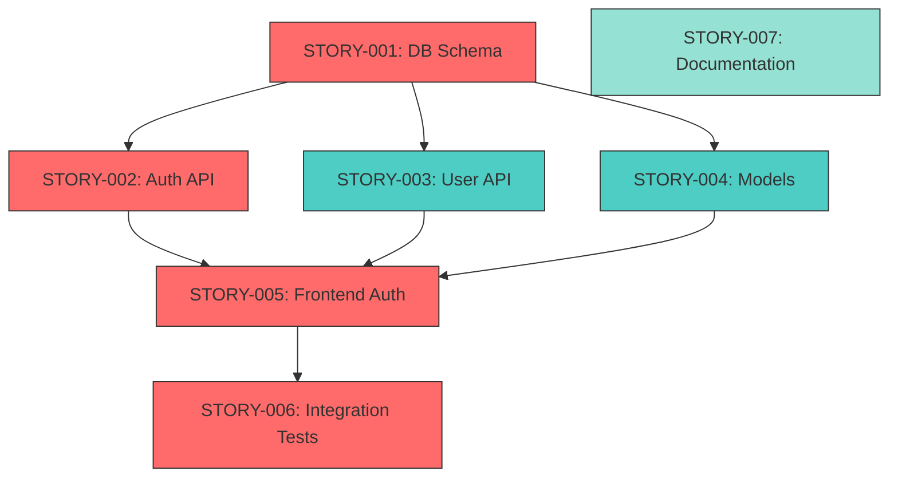
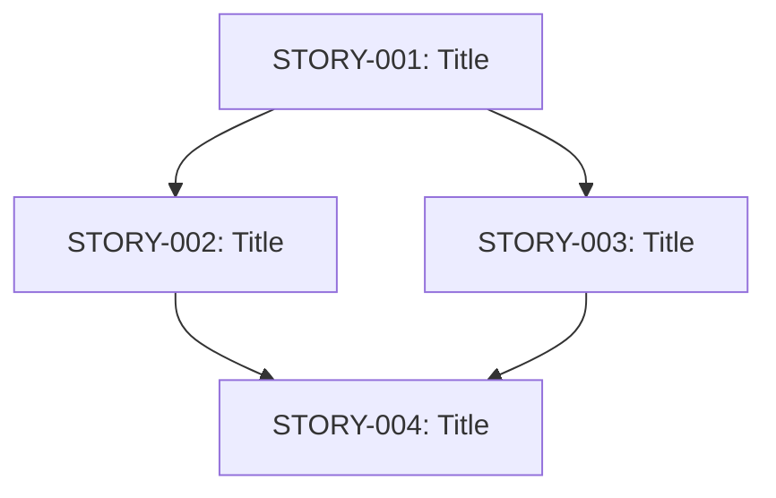

# Story Dependency Graph Module

> **INCLUDE IN STORY GENERATION AND ORCHESTRATION**
> This module defines how to create, parse, and execute story dependency graphs.

---

## Overview

Stories are not always independent. A dependency graph ensures:
- Stories execute in correct order
- Parallel execution where possible
- Critical path identification
- Blocked story detection

---

## Dependency Types

### Hard Dependencies

Story B **cannot start** until Story A completes:

```
STORY-001 (DB Schema) ──blocks──▶ STORY-002 (API Endpoints)
```

Notation: `depends_on: [STORY-001]`

### Soft Dependencies

Story B **should wait** for Story A, but can proceed if necessary:

```
STORY-003 (Frontend) ~~prefers~~ STORY-002 (API)
```

Notation: `prefers: [STORY-002]`

### No Dependencies

Story can execute immediately, in parallel with others:

```
STORY-005 (Documentation) ── independent
```

Notation: `depends_on: []`

---

## Story Metadata Format

Each story MUST include dependency metadata:

```markdown
---
story_id: STORY-001
title: Database Schema for User Authentication
priority: 1
complexity: medium
estimated_tokens: 15000
layers: [database]
depends_on: []
prefers: []
blocks: [STORY-002, STORY-003]
parallel_group: null
---
```

### Field Definitions

| Field | Type | Description |
|-------|------|-------------|
| `story_id` | string | Unique identifier (STORY-XXX) |
| `title` | string | Human-readable title |
| `priority` | int | Execution priority (1=highest) |
| `complexity` | enum | simple/medium/complex |
| `estimated_tokens` | int | Expected context tokens needed |
| `layers` | array | Affected layers: database/backend/frontend |
| `depends_on` | array | Stories that MUST complete first |
| `prefers` | array | Stories that SHOULD complete first |
| `blocks` | array | Stories that cannot start until this completes |
| `parallel_group` | string | Group name for parallel execution |

---

## Dependency Graph Generation

### Algorithm

```
1. Parse all story files
2. Extract dependency metadata
3. Build directed acyclic graph (DAG)
4. Detect cycles (reject if found)
5. Calculate execution order (topological sort)
6. Identify parallel opportunities
7. Calculate critical path
```

### Graph Representation

```
┌─────────────────────────────────────────────────────────────┐
│                    DEPENDENCY GRAPH                         │
├─────────────────────────────────────────────────────────────┤
│                                                             │
│   STORY-001 (DB Schema)                                     │
│       │                                                     │
│       ├───────────────┬───────────────┐                     │
│       ▼               ▼               ▼                     │
│   STORY-002       STORY-003       STORY-004                 │
│   (Auth API)      (User API)      (Models)                  │
│       │               │               │                     │
│       └───────────────┴───────────────┘                     │
│                       │                                     │
│                       ▼                                     │
│                   STORY-005                                 │
│                   (Frontend Auth)                           │
│                       │                                     │
│                       ▼                                     │
│                   STORY-006                                 │
│                   (Integration Tests)                       │
│                                                             │
└─────────────────────────────────────────────────────────────┘

PARALLEL OPPORTUNITIES:
├── Group A: STORY-002, STORY-003, STORY-004 (after STORY-001)
└── Independent: STORY-007 (Documentation)

CRITICAL PATH:
STORY-001 → STORY-002 → STORY-005 → STORY-006
Estimated: 4 sequential steps, ~45K tokens
```

### Mermaid Format

For visual representation:



---

## Execution Strategies

### Sequential Execution

All stories execute one at a time in dependency order:

```
STORY-001 → STORY-002 → STORY-003 → STORY-004 → STORY-005
```

**Pros**: Simple, predictable
**Cons**: Slower, no parallelism

### Parallel Execution

Independent stories execute simultaneously:

```
STORY-001
    ↓
┌───┴───┬───────┐
↓       ↓       ↓
S002    S003    S004  (parallel)
└───┬───┴───────┘
    ↓
STORY-005
```

**Pros**: Faster completion
**Cons**: Requires context isolation

### Wave Execution

Stories grouped into waves, each wave runs in parallel:

```
Wave 1: [STORY-001]                    (foundation)
Wave 2: [STORY-002, STORY-003, STORY-004]  (parallel)
Wave 3: [STORY-005]                    (depends on wave 2)
Wave 4: [STORY-006]                    (depends on wave 3)
```

**Pros**: Balanced approach
**Cons**: Some waiting between waves

---

## INDEX.md Template

Every story folder MUST have an INDEX.md:

```markdown
# [PRD Name] - Story Index

**PRD**: [filename.md]
**Generated**: [timestamp]
**Total Stories**: [N]
**Estimated Tokens**: [X]K

---

## Dependency Graph



---

## Execution Plan

### Critical Path
`STORY-001 → STORY-002 → STORY-004`
- Steps: 3
- Estimated Tokens: ~35K

### Parallel Opportunities
| Group | Stories | Can Run After |
|-------|---------|---------------|
| Group A | STORY-002, STORY-003 | STORY-001 |

### Wave Plan
| Wave | Stories | Dependencies Met |
|------|---------|------------------|
| 1 | STORY-001 | None (foundation) |
| 2 | STORY-002, STORY-003 | Wave 1 complete |
| 3 | STORY-004 | Wave 2 complete |

---

## Story Status

| Story | Title | Status | Layers | Blocked By |
|-------|-------|--------|--------|------------|
| STORY-001 | DB Schema | PENDING | DB | - |
| STORY-002 | Auth API | PENDING | BE | STORY-001 |
| STORY-003 | User API | PENDING | BE | STORY-001 |
| STORY-004 | Frontend | PENDING | FE | STORY-002, STORY-003 |

---

## Layer Coverage

| Layer | Stories | Coverage |
|-------|---------|----------|
| Database | STORY-001 | Schema, migrations |
| Backend | STORY-002, STORY-003 | Auth, User APIs |
| Frontend | STORY-004 | Auth UI, User UI |
| Tests | STORY-005 | Integration tests |

---

## Risks

| Risk | Stories Affected | Mitigation |
|------|------------------|------------|
| [Risk 1] | STORY-002, STORY-003 | [Mitigation] |

---

## Notes

- [Any important notes about dependencies]
- [Assumptions made during graph generation]
```

---

## Cycle Detection

Cycles in dependencies are **fatal errors**:

```
❌ DEPENDENCY CYCLE DETECTED

STORY-002 depends on STORY-003
STORY-003 depends on STORY-004
STORY-004 depends on STORY-002  ← CYCLE!

This creates an impossible execution order.

RESOLUTION OPTIONS:
1. Remove one dependency
2. Merge stories into single unit
3. Restructure story breakdown

Cannot proceed until cycle is resolved.
```

---

## Blocked Story Handling

When a story is blocked:

```
⚠️ STORY BLOCKED

STORY-003 cannot execute:
├── Depends on: STORY-002 (FAILED)
├── Status: BLOCKED
└── Resolution: Fix STORY-002 first

OPTIONS:
1. Fix STORY-002 and retry
2. Skip STORY-003 (may break downstream)
3. Remove dependency if optional
```

---

## Integration with /go

The `/go` skill uses the dependency graph:

```
1. Generate stories from PRD
2. Build dependency graph
3. Validate graph (no cycles)
4. Generate INDEX.md
5. Calculate execution order
6. Execute wave by wave:
   - Complete wave N
   - Validate all wave N stories passed
   - Proceed to wave N+1
7. Track blocked stories
8. Report final status
```

---

## API for Programmatic Use

### Graph Operations

```typescript
interface DependencyGraph {
  // Build graph from story files
  build(storyDir: string): Graph;

  // Get execution order
  getExecutionOrder(): Story[];

  // Get stories that can run now
  getReady(completed: Story[]): Story[];

  // Get stories blocked by a failure
  getBlocked(failed: Story): Story[];

  // Calculate critical path
  getCriticalPath(): Story[];

  // Get parallel groups
  getParallelGroups(): StoryGroup[];

  // Validate graph (no cycles)
  validate(): ValidationResult;
}

interface Story {
  id: string;
  title: string;
  depends_on: string[];
  blocks: string[];
  status: 'pending' | 'in_progress' | 'completed' | 'failed' | 'blocked';
}

interface StoryGroup {
  name: string;
  stories: Story[];
  can_run_after: string[];
}
```

---

## Quick Reference

### Adding Dependencies to a Story

```markdown
---
story_id: STORY-003
depends_on: [STORY-001, STORY-002]
blocks: [STORY-005]
---
```

### Checking if Story Can Execute

```
Can execute if:
1. All `depends_on` stories are COMPLETED
2. No cycle exists
3. Context budget allows

Cannot execute if:
1. Any `depends_on` story is PENDING/IN_PROGRESS/FAILED
2. Would create cycle
3. Context budget insufficient
```

### Parallel Execution Criteria

Stories can run in parallel if:
1. No dependency relationship between them
2. Affect different files (no merge conflicts)
3. Context can be isolated per story

---

## Remember

> "Dependencies are contracts. Honor them."

> "Parallel execution is a privilege earned by independence."

> "Cycles are architecture failures. Fix the design, not the graph."
