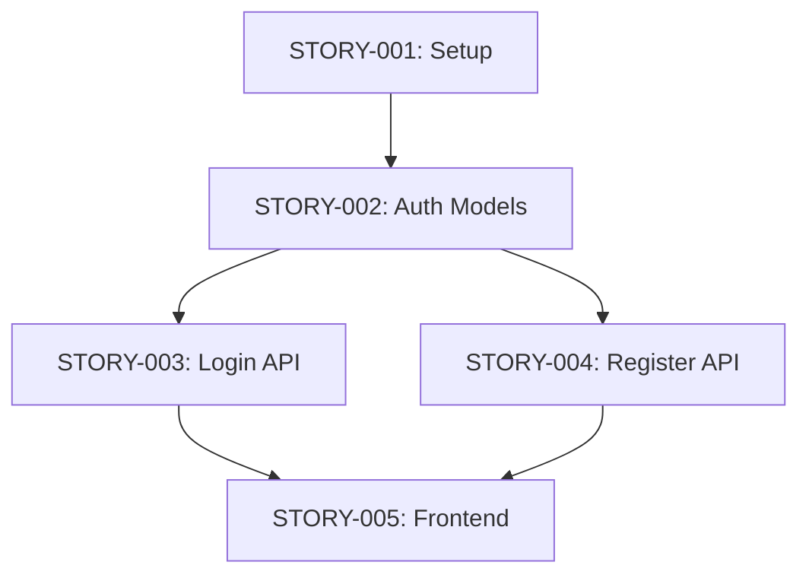

# API Reference - Agent Protocols

Reference documentation for SkillFoundry Framework agent protocols and communication standards.

---

## Agent Communication Protocol

### Request Format

```json
{
  "agent_id": "ruthless-coder",
  "task_id": "STORY-001",
  "request_type": "implement",
  "context": {
    "prd_id": "user-authentication",
    "story_id": "STORY-001",
    "dependencies": ["STORY-000"],
    "layers": ["database", "backend"]
  },
  "requirements": {
    "acceptance_criteria": ["..."],
    "security_checks": true,
    "tdd_enforcement": "STRICT"
  },
  "constraints": {
    "max_tokens": 50000,
    "timeout": 300
  }
}
```

### Response Format

```json
{
  "agent_id": "ruthless-coder",
  "task_id": "STORY-001",
  "status": "SUCCESS",
  "status_code": "SUCCESS",
  "summary": "<500 token summary>",
  "artifacts": {
    "files_created": ["..."],
    "files_modified": ["..."],
    "tests_created": ["..."]
  },
  "metrics": {
    "tokens_used": 45000,
    "duration_seconds": 120,
    "test_coverage": 85
  },
  "next_steps": ["STORY-002"],
  "errors": []
}
```

### Status Codes

| Code | Meaning | Action |
|------|---------|--------|
| `SUCCESS` | Task completed successfully | Proceed to next |
| `PARTIAL` | Partial completion, needs review | Review and continue |
| `FAILED` | Task failed | Retry or escalate |
| `BLOCKED` | Blocked by dependency | Wait for dependency |
| `SKIPPED` | Intentionally skipped | Continue |

---

## Agent Handoff Protocol

### Standard Handoff

```markdown
## Agent Handoff: [FROM] → [TO]

**Task**: [STORY-XXX]
**Status**: [SUCCESS/PARTIAL/FAILED]
**Summary**: [<500 tokens]

**Artifacts**:
- Files: [list]
- Tests: [list]
- Documentation: [list]

**Next Steps**:
- [Action 1]
- [Action 2]

**Context**: [minimal context for next agent]
```

### Handoff Checklist

- [ ] Summary < 500 tokens
- [ ] Artifacts listed
- [ ] Next steps clear
- [ ] Context minimal
- [ ] Status code set

---

## Story Dependency Graph Protocol

### Dependency Types

```yaml
dependencies:
  depends_on:      # Hard dependency (blocks)
    - STORY-001
  blocks:          # This story blocks others
    - STORY-003
  prefers:         # Soft dependency (preferred order)
    - STORY-002
```

### Dependency Resolution

1. **Topological Sort**: Order by dependencies
2. **Parallel Execution**: Independent stories run simultaneously
3. **Cycle Detection**: Fatal error if circular dependencies

### Example Graph



---

## State Machine Protocol

### States

```
IDLE → INITIALIZING → LOADING_PRD → VALIDATING → 
GENERATING_STORIES → EXECUTING_STORY → VALIDATING_LAYERS → 
SECURITY_AUDIT → DOCUMENTING → COMPLETED
```

### State Transitions

| From | To | Trigger |
|------|-----|---------|
| IDLE | INITIALIZING | `/go` command |
| INITIALIZING | LOADING_PRD | PRD found |
| LOADING_PRD | VALIDATING | PRD loaded |
| VALIDATING | GENERATING_STORIES | Validation passed |
| EXECUTING_STORY | VALIDATING_LAYERS | Story completed |
| VALIDATING_LAYERS | SECURITY_AUDIT | Layers validated |
| SECURITY_AUDIT | DOCUMENTING | Security passed |
| DOCUMENTING | COMPLETED | Documentation complete |

### Error States

- **ERROR**: Recoverable error, can retry
- **ROLLING_BACK**: Undoing changes
- **BLOCKED**: Waiting for dependency

---

## Rollback Protocol

### Rollback Manifest

```json
{
  "execution_id": "exec-20260125-123456",
  "timestamp": "2026-01-25T12:34:56Z",
  "changes": [
    {
      "type": "file_create",
      "path": "backend/models/user.py",
      "backup": ".claude/backups/exec-20260125-123456/user.py"
    },
    {
      "type": "file_modify",
      "path": "backend/api/auth.py",
      "backup": ".claude/backups/exec-20260125-123456/auth.py"
    },
    {
      "type": "migration",
      "name": "001_create_users",
      "rollback": "001_create_users.down.sql"
    }
  ]
}
```

### Rollback Commands

```bash
/go --rollback              # Rollback last execution
/go --rollback STORY-XXX    # Rollback to before story
```

---

## Metrics Protocol

### Metric Types

```json
{
  "execution_metrics": {
    "total_stories": 10,
    "completed_stories": 8,
    "failed_stories": 1,
    "skipped_stories": 1,
    "total_duration_seconds": 3600,
    "average_story_duration": 450
  },
  "agent_metrics": {
    "ruthless-coder": {
      "invocations": 8,
      "success_rate": 0.875,
      "average_tokens": 45000,
      "average_duration": 120
    }
  },
  "layer_metrics": {
    "database": { "stories": 3, "success_rate": 1.0 },
    "backend": { "stories": 5, "success_rate": 0.8 },
    "frontend": { "stories": 2, "success_rate": 1.0 }
  }
}
```

### Metrics Collection

- Automatic during `/go` execution
- Stored in `.claude/metrics.json`
- Exportable via `/metrics export [format]`

---

## Test Execution Protocol

### Test Framework Detection

Automatically detects:
- Jest/Vitest (Node.js)
- pytest (Python)
- dotnet test (.NET)
- cargo test (Rust)
- go test (Go)

### Test Result Format

```json
{
  "framework": "jest",
  "total_tests": 25,
  "passed": 23,
  "failed": 2,
  "skipped": 0,
  "duration_ms": 1500,
  "coverage": {
    "lines": 85,
    "branches": 80,
    "functions": 90
  },
  "failures": [
    {
      "test": "UserService.createUser",
      "error": "AssertionError: expected ...",
      "file": "tests/user.service.test.ts",
      "line": 45
    }
  ]
}
```

---

## Gate Verification Protocol

### Gate Types

| Gate | Command | Purpose |
|------|---------|---------|
| Tests | `/verify tests` | Run tests, verify all pass |
| Build | `/verify build` | Clean build, no warnings |
| Coverage | `/verify coverage` | Check coverage threshold |
| Lint | `/verify lint` | Code passes linting |
| Security | `/verify security` | Security scans pass |
| API | `/verify api` | API health checks |
| Migration | `/verify migration` | Migrations work |
| Docs | `/verify docs` | Documentation complete |
| Patterns | `/verify patterns` | No banned patterns |

### Composite Gates

```bash
/verify production    # Runs all gates
/verify development   # Runs subset
```

### Custom Gates

Define in `.claude/gates.json`:

```json
{
  "custom_gates": [
    {
      "name": "performance",
      "command": "npm run perf-test",
      "threshold": "p95 < 500ms"
    }
  ]
}
```

---

## Context Discipline Protocol

### Token Budget Levels

| Level | Content | Size | Usage |
|-------|---------|------|-------|
| Level 1 | CLAUDE-SUMMARY.md + current story | ~5K tokens | Active work |
| Level 2 | Active source files | ~20K tokens | Implementation |
| Level 3 | Full documentation | ~80K tokens | Reference only |

### Budget Zones

| Zone | Range | Action |
|------|-------|--------|
| GREEN | 0-50K | Normal operation |
| YELLOW | 50-100K | Consider compaction |
| RED | >100K | Force compaction |

### Context Commands

```bash
/context              # Show status
/context compact      # Force compaction
/context budget       # Detailed breakdown
/context load 1       # Load level 1 only
```

---

## TDD Protocol

### RED-GREEN-REFACTOR Cycle

1. **RED**: Write failing test
2. **GREEN**: Minimal implementation
3. **REFACTOR**: Improve quality

### Enforcement Levels

| Level | Behavior |
|-------|----------|
| STRICT | Block implementation without test |
| WARN | Log warning, allow |
| OFF | Track only, no enforcement |

### TDD State Tracking

```json
{
  "story_id": "STORY-001",
  "cycles": [
    {
      "phase": "RED",
      "test_file": "tests/user.test.ts",
      "timestamp": "2026-01-25T10:00:00Z"
    },
    {
      "phase": "GREEN",
      "implementation_file": "src/user.ts",
      "timestamp": "2026-01-25T10:05:00Z"
    }
  ]
}
```

---

## Parallel Dispatch Protocol

### Execution Modes

| Mode | Description | Use Case |
|------|-------------|----------|
| WAVE | Groups of independent tasks | Many independent stories |
| EAGER | Start as dependencies complete | Long dependency chains |
| CONSERVATIVE | Limited concurrency | Resource constraints |

### Conflict Detection

- File overlap detection
- Resource conflict detection
- Automatic serialization if conflicts

---

## Git Worktree Protocol

### Worktree Creation

```bash
/go --worktree    # Execute in isolated worktree
```

### Worktree Structure

```
.claude/worktrees/
├── prd-user-auth/
│   ├── .git/          # Worktree git
│   └── [project files]
└── prd-payments/
    └── ...
```

### Benefits

- Safe experimentation
- Easy rollback (delete folder)
- Parallel PRD development

---

## Security Scanner Protocol

### Scan Modes

| Mode | Coverage | Speed |
|------|----------|-------|
| Quick | Top 7 critical | Fast |
| Comprehensive | All 15 patterns | Slower |
| Targeted | Specific vulnerability | Fast |

### Vulnerability Format

```json
{
  "severity": "CRITICAL",
  "pattern": "Hardcoded Secrets",
  "file": "src/config.js",
  "line": 15,
  "code": "const API_KEY = 'sk-1234567890';",
  "fix": "Use environment variable: process.env.API_KEY",
  "reference": "docs/ANTI_PATTERNS_DEPTH.md#pattern-1"
}
```

---

## API Endpoints (If Backend Exists)

### Framework Management

```
GET  /api/framework/version
GET  /api/framework/status
POST /api/framework/update
```

### Project Management

```
GET  /api/projects
POST /api/projects
GET  /api/projects/:id
PUT  /api/projects/:id
```

### Metrics

```
GET  /api/metrics
GET  /api/metrics/agents
GET  /api/metrics/stories
GET  /api/metrics/export/:format
```

---

## Error Codes

| Code | Meaning | Resolution |
|------|---------|------------|
| `E001` | PRD not found | Create PRD in genesis/ |
| `E002` | Validation failed | Fix PRD issues |
| `E003` | Dependency cycle | Fix dependencies |
| `E004` | Context overflow | Compact context |
| `E005` | Test failure | Fix tests |
| `E006` | Security violation | Fix security issues |
| `E007` | Rollback failed | Manual intervention |

---

**Last Updated**: 2026-01-25  
**Version**: 1.3.1
