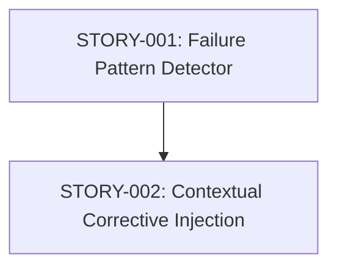

# Stories: Dynamic Skill Optimization

**PRD:** [genesis/2026-05-05-dynamic-skill-optimization.md](../../genesis/2026-05-05-dynamic-skill-optimization.md)
**Total Stories:** 2
**Critical Path:** STORY-001 -> STORY-002

## Story Map

## Story Index

| ID | Title | Status | Priority | Blocks |
|----|-------|--------|----------|--------|
| STORY-001 | Failure Pattern & Quirk Detection | TODO | MUST | 002 |
| STORY-002 | Dynamic Prompt Optimization & Injection | TODO | MUST | - |
