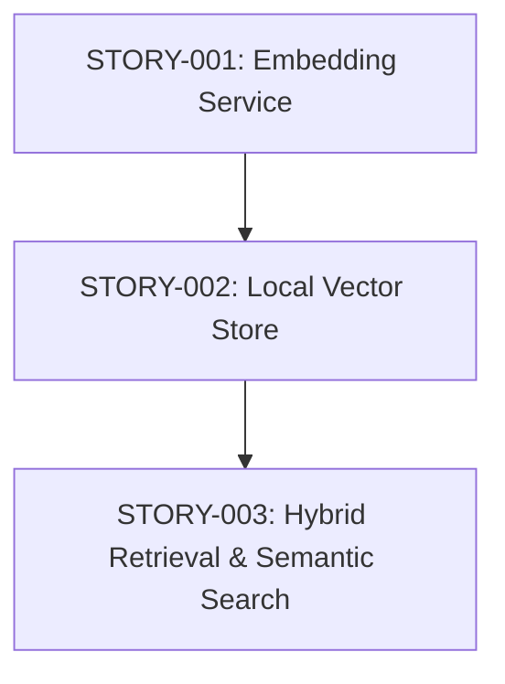

# Stories: Local Vector Memory

**PRD:** [genesis/2026-05-05-local-vector-memory.md](../../genesis/2026-05-05-local-vector-memory.md)
**Total Stories:** 3
**Critical Path:** STORY-001 -> STORY-002 -> STORY-003

## Story Map

## Story Index

| ID | Title | Status | Priority | Blocks |
|----|-------|--------|----------|--------|
| STORY-001 | Implement Local Embedding Service (Transformers.js) | TODO | MUST | 002 |
| STORY-002 | Local Vector Store (HNSW/Flat-file) | TODO | MUST | 003 |
| STORY-003 | Hybrid Recall: Keyword + Semantic Similarity | TODO | MUST | - |
