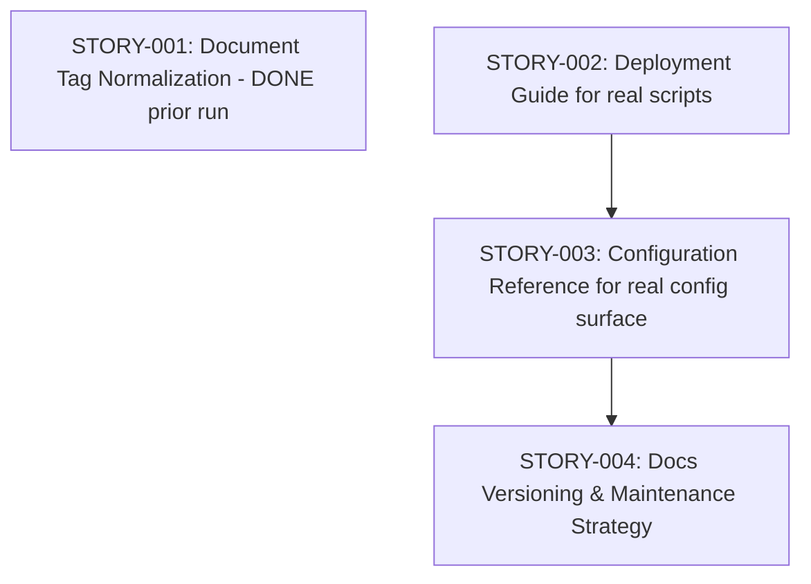

# Stories: Documentation & Knowledge Base Enhancement (FR-DOCS-104)

**PRD:** [genesis/prd-from-orchestrator.md](../../../genesis/prd-from-orchestrator.md)
**Total Stories:** 4 (1 prior + 3 new in this forge run)
**Critical Path:** STORY-002 → STORY-003 → STORY-004

## Reality Adaptation

The PRD names two files that **do not exist** in this repository:

| PRD reference | Reality in repo | Adaptation |
|---|---|---|
| `deploy.sh` | absent | Documented the real deploy/install scripts: `install-unified.sh`, `update.sh`, `scripts/dashboard.sh`, `scripts/knowledge-sync.sh` |
| `tower.json` | absent | Documented the real configuration surface: `.claude/settings.json`, `package.json` scripts, `sf_cli/` config |

Per CLAUDE.md ("ONLY REAL LOGIC. No placeholders, no fake data."), the deliverables describe the actual artifacts on disk rather than hallucinated ones from the PRD text.

## Story Map

## Story Index

| ID | Title | Status | Priority | Blocks |
|----|-------|--------|----------|--------|
| STORY-001 | Document Tag Normalization | DONE | MUST | - |
| STORY-002 | Deployment Guide for real scripts | DONE | MUST | STORY-003 |
| STORY-003 | Configuration Reference for real config | DONE | MUST | STORY-004 |
| STORY-004 | Docs Versioning & Maintenance Strategy | DONE | SHOULD | - |
