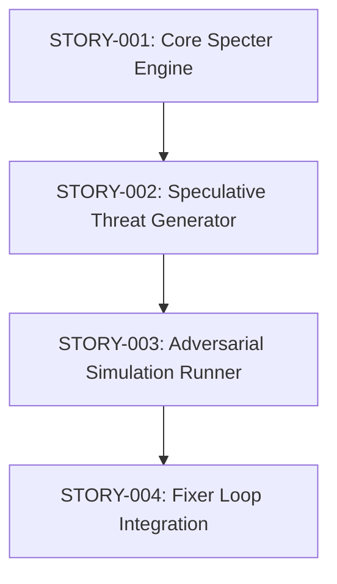

# Stories: 'Specter' Security Engine

**PRD:** [genesis/2026-05-05-specter-security-engine.md](../../genesis/2026-05-05-specter-security-engine.md)
**Total Stories:** 4
**Critical Path:** STORY-001 -> STORY-002 -> STORY-003 -> STORY-004

## Story Map

## Story Index

| ID | Title | Status | Priority | Blocks |
|----|-------|--------|----------|--------|
| STORY-001 | Implement Core Specter Engine Infrastructure | DONE | MUST | 002 |
| STORY-002 | Speculative Threat Generator (Red Team Agent) | DONE | MUST | 003 |
| STORY-003 | Adversarial Simulation Runner (curl/mock) | DONE | MUST | 004 |
| STORY-004 | Specter-Fixer Integration & Hardening Loop | DONE | MUST | - |
