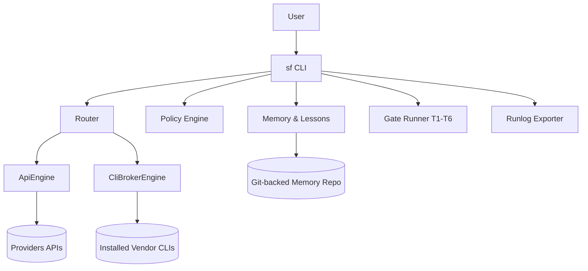

# PRD: Add a CLI to SkillFoundry Framework

---
prd_id: skillfoundry-cli-platform
title: Add a CLI to SkillFoundry Framework
version: 1.0
status: DRAFT
created: 2026-02-22
author: SkillFoundry Team + Codex
last_updated: 2026-02-22

# DEPENDENCIES
dependencies:
  requires: []
  recommends: [autonomous-developer-loop]
  blocks: []
  shared_with: [competitive-leap]

tags: [core, cli, provider-routing, governance, memory]
priority: high
layers: [backend]
---

---

## 1. Overview

### 1.1 Problem Statement

SkillFoundry currently has powerful agents and workflows, but users rely on scattered commands and platform-specific tooling. This limits adoption against integrated coding CLIs (Claude Code, Gemini CLI, Codex CLI), creates inconsistent workflows, and weakens product identity. The framework needs a single, opinionated CLI surface that unifies providers, enforces safety, and captures organizational memory.

### 1.2 Proposed Solution

Build a first-class `sf` CLI that acts as the unified control plane for all SkillFoundry workflows. The CLI will support two execution engines: direct provider APIs and broker mode via existing vendor CLIs (for users already subscribed). The experience will be memory-native and governance-first: plan/apply gates, policy enforcement, audit logs, and automatic lesson capture.

### 1.3 Success Metrics

| Metric | Current | Target | How to Measure |
|--------|---------|--------|----------------|
| Time-to-first-successful-run | >20 minutes | <5 minutes | Fresh install test, median across 20 runs |
| Commands needed to execute a feature task | 4-8 | <=2 | Session telemetry from run logs |
| Runs with full audit bundle | 0% | 100% | Presence of run bundle artifact per apply |
| Policy violations reaching apply phase | Unknown | <2% | Policy check and gate failure metrics |
| Memory-assisted resolutions (lesson recalled and used) | Ad hoc | >=40% of bug/refactor runs | Run log memory-hit counters |

---

## 2. User Stories

### Primary User: Individual Developer

| ID | As a... | I want to... | So that... | Priority |
|----|---------|--------------|------------|----------|
| US-001 | developer | run `sf plan "task"` and `sf apply` | I can complete work with deterministic checkpoints | MUST |
| US-002 | developer | switch providers without changing workflow | I avoid lock-in to one AI vendor | MUST |
| US-003 | developer | use existing vendor CLI subscriptions where possible | I control API spend | MUST |
| US-004 | developer | chat with repo context and memory recall | I get faster, more relevant results | SHOULD |

### Secondary User: Team Lead / Engineering Manager

| ID | As a... | I want to... | So that... | Priority |
|----|---------|--------------|------------|----------|
| US-010 | team lead | enforce policy and budget limits | agent runs stay safe and cost-predictable | MUST |
| US-011 | team lead | export auditable run logs | reviews and compliance checks are reproducible | MUST |
| US-012 | team lead | capture and reuse lessons learned | teams stop repeating known failures | MUST |

---

## 3. Functional Requirements

### 3.1 Core Commands

| ID | Requirement | Description | Acceptance Criteria |
|----|-------------|-------------|---------------------|
| FR-001 | `sf init` | Initialize workspace config, policy, and local run directories | Given a repo without config, When `sf init` runs, Then `.skillfoundry/` config files are created |
| FR-002 | `sf plan` | Read-only planning with context + memory retrieval | Given a task string, When `sf plan` runs, Then no files are written and a plan ID is returned |
| FR-003 | `sf apply` | Execute an approved plan with mandatory quality gates | Given a plan ID, When `sf apply` runs, Then T1-T6 gates execute and run result is emitted |
| FR-004 | `sf chat` | Interactive repo-aware chat mode | Given chat mode, When user asks a question, Then response includes provider route and optional memory references |
| FR-005 | `sf ask` | One-shot prompt mode | Given prompt text, When `sf ask` runs, Then a single response is returned with route metadata |
| FR-006 | `sf provider` | Configure provider, engine mode, model routing | Given provider command, When executed, Then config updates and route validation occurs |
| FR-007 | `sf policy` | Validate/print active policy rules | Given `sf policy check`, When run, Then violations are listed with block/allow decision |
| FR-008 | `sf memory` + `sf lessons` | Recall and persist learnings from runs | Given run ID, When recording lessons, Then entries are stored in memory and linked to run |
| FR-009 | `sf runlog export` | Export immutable run bundle | Given run ID, When export runs, Then JSON artifact includes plan, commands, diffs, tests, and outcomes |

### 3.2 Provider and Engine Requirements

| ID | Requirement | Description | Acceptance Criteria |
|----|-------------|-------------|---------------------|
| FR-020 | API Engine | Direct calls to provider APIs (Anthropic, OpenAI, xAI, Gemini, Ollama-compatible) | Given valid keys, When API mode selected, Then requests execute through provider adapter |
| FR-021 | CLI Broker Engine | Execute via installed vendor CLI (`claude`, `gemini`, others as available) | Given broker mode and installed tool, When run starts, Then output is captured and normalized |
| FR-022 | Unified Response Contract | Normalize responses across engines | Given mixed providers, When results return, Then output fields are consistent (`text`, `usage`, `route`, `errors`) |
| FR-023 | Fallback Policy | Route fallback between engines/providers by policy | Given primary route failure, When fallback allowed, Then CLI retries according to configured order |

### 3.3 Governance, Cost, and Safety

| ID | Requirement | Description | Acceptance Criteria |
|----|-------------|-------------|---------------------|
| FR-030 | Budget Controls | Per-run, per-user, and monthly budget caps | Given caps exceeded, When run starts, Then execution blocks with a clear reason |
| FR-031 | Redaction | Automatic redaction of tokens, credentials, and common secret patterns | Given secret-like output, When displayed/exported, Then secret values are masked |
| FR-032 | Command Restrictions | Shell/network/path policy enforcement | Given disallowed command/path/network access, When requested, Then run blocks and logs violation |
| FR-033 | Anvil Gate Integration | Enforce T1-T6 between plan/apply and agent handoffs | Given `sf apply`, When any gate fails, Then apply aborts with failure report |

### 3.4 Memory and Learning

| ID | Requirement | Description | Acceptance Criteria |
|----|-------------|-------------|---------------------|
| FR-040 | Memory Recall | Retrieve relevant prior runs/lessons before planning | Given similar historical work, When planning, Then recall list is included in plan context |
| FR-041 | Lesson Capture | Save structured lessons from failures and fixes | Given completed run, When `sf lessons capture` runs, Then lesson entry is persisted with source link |
| FR-042 | GitHub Memory Sync | Push approved memory artifacts to configured repository | Given sync enabled, When run closes, Then memory changes are committed and pushed |

### 3.5 UX/UI Requirements (Competitive CLI Experience)

| ID | Requirement | Description | Acceptance Criteria |
|----|-------------|-------------|---------------------|
| FR-050 | Full-Screen TUI Shell | Provide an optional full-screen terminal UI in addition to command mode | Given `sf` launches in interactive mode, When no subcommand is passed, Then a full-screen TUI opens |
| FR-051 | Three-Pane Information Architecture | Standard layout with navigation, activity stream, and context panel | Given TUI mode, When an operation runs, Then users can view progress, plan/gates, and memory/policy context simultaneously |
| FR-052 | Streaming Operation Timeline | Real-time step-by-step timeline similar to modern coding CLIs | Given `plan` or `apply`, When execution is in progress, Then each phase emits live status updates (queued, running, pass/fail) |
| FR-053 | Rich Diff and Patch Preview | Inline diff viewer with approval checkpoint before apply | Given pending file changes, When user requests apply, Then a colorized diff is shown and approval is required |
| FR-054 | Keyboard-First Interaction | Fast command palette and key shortcuts for core flows | Given TUI mode, When user presses configured shortcuts, Then provider switch, run history, memory recall, and apply checkpoint actions are available |
| FR-055 | Conversation + Command Dual Mode | Seamless switch between `chat` style and structured command execution | Given an interactive session, When user toggles mode, Then context is preserved and output format stays consistent |
| FR-056 | Error/Recovery UX | Actionable recovery options on failures | Given provider/policy/gate failure, When error is shown, Then next actions are displayed (retry, fallback, open logs, edit policy) |
| FR-057 | Theming and Visual Consistency | Consistent spacing, color semantics, and typography tokens in terminal rendering | Given any screen, When statuses are displayed, Then warning/error/success colors and spacing follow design tokens |
| FR-058 | Accessibility in Terminal | High-contrast mode, reduced-motion mode, and screen-reader-friendly plain output | Given accessibility flags enabled, When commands run, Then output avoids inaccessible color-only signaling and respects reduced-motion settings |

---

## 4. CLI Contract Specification

### 4.1 Command Surface (v1)

```text
sf init
sf plan "<task>" [--provider <name>] [--model <id>] [--budget <usd>] [--json]
sf apply --plan <plan-id> [--checkpoint]
sf chat [--provider <name>] [--engine api|broker]
sf ask "<prompt>" [--provider <name>] [--raw|--json]
sf provider set <name>
sf provider list
sf policy check
sf memory recall "<query>"
sf memory record --from-run <run-id>
sf lessons capture --from-run <run-id>
sf runlog export --run <run-id> [--out <path>]
```

### 4.2 Exit Codes

| Code | Meaning |
|------|---------|
| 0 | Success |
| 1 | User/config/runtime error |
| 2 | Policy violation blocked run |
| 3 | Provider route failure (no successful fallback) |
| 4 | Gate failure (T1-T6) |
| 5 | Budget exceeded |

### 4.3 Output Standards

- Human mode: concise progress lines with route, policy status, and gate status.
- JSON mode: machine-readable object with stable top-level keys: `status`, `route`, `plan_id`, `run_id`, `usage`, `cost`, `violations`, `errors`.
- All outputs must exclude raw secrets.

### 4.4 Interactive UX Contract (v1 TUI)

- Primary regions:
  - Left pane: commands, modes, run history.
  - Center pane: live execution stream, chat, diffs, gate timeline.
  - Right pane: policy status, provider route, budget, memory hits, lessons.
- Mandatory views:
  - Home dashboard.
  - Plan preview.
  - Apply checkpoint with diff approval.
  - Chat session view.
  - Run detail + export status.
- Required keyboard shortcuts:
  - `Ctrl+P`: command palette.
  - `Ctrl+R`: route/provider switcher.
  - `Ctrl+L`: memory/lesson lookup.
  - `Ctrl+A`: apply checkpoint action.
  - `Ctrl+J/K`: stream navigation.
- Fallback behavior:
  - If terminal does not support full-screen rendering, CLI must degrade to readable line mode without feature loss.

---

## 5. Non-Functional Requirements

### 5.1 Performance

| Metric | Requirement |
|--------|-------------|
| `sf plan` startup | < 2s excluding model latency |
| `sf apply` gate overhead | < 20s for medium repo baseline |
| Memory recall lookup | < 500ms median (local index) |
| CLI cold start | < 300ms |

### 5.2 Security

| Aspect | Requirement |
|--------|-------------|
| API Keys | Read from environment or secure store only; never printed |
| Output Redaction | Enabled by default for terminal and runlog exports |
| Local Data | `.skillfoundry/runs` permissions restricted to current user |
| Remote Sync | Git push only to configured origin; explicit opt-in required |

### 5.3 Reliability

| Metric | Target |
|--------|--------|
| Plan/apply command success (non-provider errors excluded) | >= 99% |
| Run log write durability | 100% for completed runs |
| Fallback route success after primary failure | >= 80% |

### 5.4 Observability

- Structured run events with timestamps and correlation IDs.
- Per-run provider usage and cost summary.
- Policy and gate failure counters per workspace.

### 5.5 UX Quality and Accessibility

| Metric | Requirement |
|--------|-------------|
| Input-to-first-feedback | <= 150ms for interactive commands |
| Diff preview render (<= 500 lines) | <= 300ms |
| Keyboard-only flow coverage | 100% of core actions (plan, apply, chat, provider switch, export) |
| Color-only signaling | 0 critical states may rely on color alone |
| Accessibility modes | Must support `--high-contrast` and `--reduced-motion` |

---

## 6. Technical Specifications

### 6.1 High-Level Architecture



### 6.2 Data Artifacts

- `.skillfoundry/config.toml` — provider defaults, routing, budgets.
- `.skillfoundry/policy.toml` — command/path/network/redaction rules.
- `.skillfoundry/runs/<run-id>.json` — immutable run bundle.
- `memory_bank/knowledge/*.jsonl` — lessons and decision entries.

### 6.3 Dependencies

| Dependency | Version | Purpose | Risk if Unavailable |
|------------|---------|---------|---------------------|
| Runtime (Node or Python) | TBD | CLI implementation runtime | CLI cannot execute |
| `git` | 2.x+ | runlog and memory sync workflows | no remote sync |
| Vendor CLIs (`claude`, `gemini`, etc.) | current | broker execution mode | broker mode unavailable |

---

## 7. Rollout Plan

| Phase | Scope | Exit Criteria |
|------|-------|---------------|
| Phase 1 | `init`, `plan`, `apply`, run logs, policy check | deterministic plan/apply and complete run artifacts |
| Phase 2 | provider adapters + CLI broker mode | >=3 providers passing contract tests |
| Phase 3 | memory recall/capture + Git sync | lessons persisted and recall integrated in `sf plan` |
| Phase 4 | interactive TUI shell + UX hardening | three-pane layout, diff approvals, keyboard shortcuts, fallback line mode, accessibility modes |

---

## 8. Risks and Mitigations

| Risk | Impact | Mitigation |
|------|--------|------------|
| Vendor CLI output format changes | Broker mode breaks parsing | version pinning + adapter contract tests |
| API costs spike | user adoption drops | budget caps + route-to-cheaper-model policy |
| Over-broad autonomy | unsafe actions in apply | mandatory checkpoints + strict policy defaults |
| Memory pollution/noise | low-quality recall | lesson scoring and dedupe rules |

---

## 9. Out of Scope (v1)

- Hosted multi-tenant gateway billing and seat management.
- GUI/web dashboard for command execution.
- Full MCP marketplace integration.
- Autonomous no-approval destructive operations.

---

## 10. Definition of Done

- `sf` commands in section 4.1 implemented and documented.
- Provider API and broker engines pass shared contract tests.
- Policy engine blocks disallowed actions with deterministic exit codes.
- Anvil T1-T6 gating integrated into `sf apply` path.
- Run bundle generated for every completed apply run.
- Memory recall and lesson capture validated in at least 3 end-to-end scenarios.
- Interactive TUI contract in section 4.4 implemented with keyboard-only coverage for all core flows.
- UX quality metrics in section 5.5 validated by automated and manual checks.

---

*PRD authored under `/forge` workflow intent — ready for `/stories` and `/go --validate`.*
