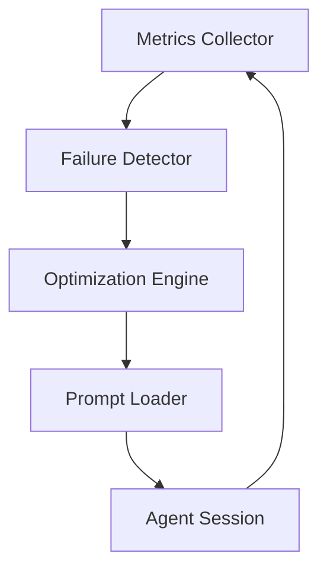

# PRD: Dynamic Skill Optimization

---
prd_id: dynamic-skill-optimization
title: Dynamic Skill Optimization
version: 1.0
status: DRAFT
created: 2026-05-05
author: Gemini CLI
last_updated: 2026-05-05

# DEPENDENCIES (for inter-PRD coordination)
dependencies:
  requires: []        
  recommends: []      
  blocks: []          
  shared_with: []     

tags: [core, feature, optimization]
priority: medium
layers: [core-engine]
---

---

## 1. Overview

### 1.1 Problem Statement
Agent prompts in SkillFoundry are currently static. If an agent consistently fails a specific quality gate (e.g., the `coder` often fails "Type Check"), the framework doesn't adapt. The developer must manually update prompts or hope the agent learns from memory. This leads to repetitive failures and inefficient token usage on strategies that aren't working.

### 1.2 Proposed Solution
Implement **Dynamic Skill Optimization**. This feature monitors the `metrics.json` and `failure-detector.ts` in real-time. When it detects a pattern of failure for a specific agent/gate combination, it automatically injects "Contextual Correctives" into the agent's prompt for that specific session.

### 1.3 Success Metrics

| Metric | Current | Target | How to Measure |
|--------|---------|--------|----------------|
| Mean Time to Success (MTTS) | Baseline | -20% | Total turns per story implementation |
| Gate Pass Rate (First Try) | ~70% | > 85% | Percentage of stories passing Anvil on T1 |
| Token Waste | Baseline | -15% | Tokens spent on failed implementation attempts |

---

## 2. User Stories

### Primary User: AI Developer Agent

| ID | As a... | I want to... | So that... | Priority |
|----|---------|--------------|------------|----------|
| US-001 | AI Developer | Receive targeted advice based on my recent failures | I can avoid repeating the same mistake in the current session. | MUST |
| US-002 | AI Developer | See a summary of "Common Pitfalls" for the current project | I can align with project-specific quirks immediately. | SHOULD |
| US-003 | AI Developer | Automatically revert prompt changes after a success streak | My prompt stays lean and focused on the current task. | COULD |

---

## 3. Functional Requirements

### 3.1 Core Features

| ID | Requirement | Description | Acceptance Criteria |
|----|-------------|-------------|---------------------|
| FR-001 | Failure Pattern Detection | Analyze `metrics.json` for 3+ consecutive failures of the same gate/agent. | System flags a "Prompt Optimization Opportunity". |
| FR-002 | Corrective Injection | Append targeted instructions (e.g., "Always use explicit casts for Prisma types") to system prompts. | Agent receives the corrective only when the failure pattern is active. |
| FR-003 | Adaptive Learning | Update agent `weights.json` based on the success of the optimized prompt. | If the optimized prompt passes, the corrective is moved to `memory_bank`. |
| FR-004 | Project Quirk Awareness | Extract "Known Quirks" from `docs/` and inject them as global constraints. | The "Deployment Quirks" table is automatically added to the `senior-engineer` prompt. |

---

## 5. Technical Specifications

### 5.1 Architecture

---

## 10. Acceptance Criteria

### 10.1 Definition of Done

- [ ] `skill-optimizer.ts` module operational in `sf_cli/src/core/`.
- [ ] Automatic prompt injection verified when a gate fails 3 times.
- [ ] Integration with `metrics.json` for real-time data sourcing.
- [ ] Proven reduction in "repetitive error loops" during `/forge` runs.
- [ ] Log entries showing when and why a prompt was optimized.
