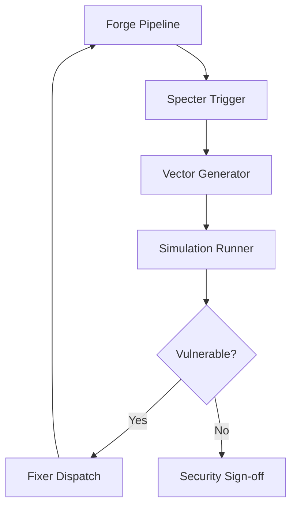

# PRD: 'Specter' Security Engine

---
prd_id: specter-security-engine
title: 'Specter' Security Engine
version: 1.0
status: DRAFT
created: 2026-05-05
author: Gemini CLI
last_updated: 2026-05-05

# DEPENDENCIES (for inter-PRD coordination)
dependencies:
  requires: []        # PRD IDs that MUST complete before this one
  recommends: []      # PRD IDs that SHOULD complete first (soft dependency)
  blocks: []          # PRD IDs that are waiting for this one
  shared_with: []     # PRD IDs that share components with this one

tags: [security, core, feature, adversarial]
priority: high
layers: [backend, core-engine]
---

---

## 1. Overview

### 1.1 Problem Statement
Current security validation in SkillFoundry is primarily static and reactive. Tools like `gitleaks` and `semgrep` scan for *known* bad patterns, but fail to detect sophisticated logic vulnerabilities, business logic bypasses, or zero-day patterns specific to the project's unique architecture. Agents often implement features that pass T1-T6 gates while remaining vulnerable to subtle adversarial manipulation.

### 1.2 Proposed Solution
The 'Specter' Security Engine introduces **Speculative Threat Modeling** into the core pipeline. Before a feature is finalized, Specter acts as a "Red Team" agent, generating 3-5 project-specific attack vectors based on the actual code changes. It then attempts to prove the vulnerability exists via simulated exploitation, forcing the `fixer` to address these logical gaps rather than just syntax or linting issues.

### 1.3 Success Metrics

| Metric | Current | Target | How to Measure |
|--------|---------|--------|----------------|
| Logic Vulnerability Detection | 5% (static) | 40% | Comparison against manual pentest findings |
| False Positive Rate | N/A | < 15% | Developer review of Specter-generated vectors |
| Security-Induced Fixes | Baseline | +25% | Number of times Specter triggers the `fixer` loop |

---

## 2. User Stories

### Primary User: AI Developer Agent

| ID | As a... | I want to... | So that... | Priority |
|----|---------|--------------|------------|----------|
| US-001 | AI Developer | Receive speculative attack vectors during implementation | I can harden the code against logical flaws before the final gate. | MUST |
| US-002 | AI Developer | Have Specter attempt to exploit my code | I can verify if my security controls are actually effective. | MUST |
| US-003 | AI Developer | See a "Security Resilience" score | I know how much effort I've put into adversarial hardening. | SHOULD |

---

## 3. Functional Requirements

### 3.1 Core Features

| ID | Requirement | Description | Acceptance Criteria |
|----|-------------|-------------|---------------------|
| FR-001 | Speculative Threat Gen | Generate attack vectors based on `git diff` and PRD context. | Given a code change, Specter produces 3 distinct attack scenarios. |
| FR-002 | Adversarial Simulation | Attempt to bypass implemented checks via tool-use (curl, mock requests). | Specter successfully identifies a bypass if logic is flawed. |
| FR-003 | Hardening Loop | Re-trigger `fixer` when an attack vector is proven viable. | Given a proven bypass, the `fixer` is dispatched with the exploit trace. |
| FR-004 | Security Proofs | Record successful mitigations as "facts" in the memory bank. | Documented proof that an attack vector is now mitigated. |

---

## 4. Non-Functional Requirements

### 4.2 Security

| Aspect | Requirement |
|--------|-------------|
| Tool-Use Safety | Specter simulations must only run in sandbox/test environments. |
| Redaction | Specter must not store actual secrets found during exploitation; it must report the *type* of leak. |
| Integrity | Specter reports must be signed to prevent tampering in the audit log. |

---

## 5. Technical Specifications

### 5.1 Architecture

### 5.7 Environment Variables

| Variable | Example / Format | Generation Method | Required | Notes |
|----------|-----------------|-------------------|----------|-------|
| SPECTER_SIM_TIMEOUT | `30000` (ms) | Manual | No | Timeout for adversarial simulations |
| SPECTER_ADVERSARIAL_LEVEL | `aggressive` | Manual | No | low | medium | aggressive |

---

## 10. Acceptance Criteria

### 10.1 Definition of Done

- [ ] Specter module integrated into `sf_cli/src/core/`.
- [ ] Ability to generate 3 project-specific attack vectors for any PRD-driven feature.
- [ ] Successful integration with the `fixer` loop on proven vulnerabilities.
- [ ] Zero tolerance for logic-bypass bugs in features passing Specter validation.
- [ ] Unit tests covering the Speculative Threat Gen logic.
