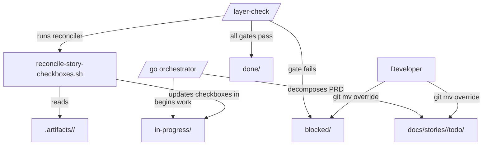

# PRD: Story Folder State Machine & Checkbox Reconciler

---
prd_id: folder-state-and-checkbox-reconciler
title: Story Folder State Machine & Checkbox Reconciler
version: 1.0
status: DRAFT
created: 2026-05-08
author: blacksamlou
last_updated: 2026-05-08

# DEPENDENCIES (for inter-PRD coordination)
dependencies:
  requires: []
  recommends:
    - autonomous-developer-loop
  blocks: []
  shared_with:
    - sf-orchestrator

tags: [framework, orchestration, anvil, stories, dx]
priority: medium
layers: [backend]   # framework-internal — no DB, no UI
---

---

## 1. Overview

### 1.1 Problem Statement

Story state in SkillFoundry today is **implicit**. Once `/go` decomposes a PRD into `docs/stories/<feature>/STORY-XXX.md`, there is no machine-readable signal of whether a story is queued, in flight, blocked at an Anvil gate, or complete. Reviewers must open each story and read its checkboxes; the LLM updates `- [ ]` → `- [x]` from memory and frequently forgets, leaving stories that *appear* unfinished even when the code, tests, and gates have all passed. This produces two recurring failure modes: (1) `/go` re-runs work that is already complete, and (2) humans cannot tell at a glance which stories are blocked.

### 1.2 Proposed Solution

Make story state **explicit and Git-visible** via two additions:

1. **Folder-as-state-machine** — every feature directory under `docs/stories/<feature>/` gets `todo/`, `in-progress/`, `blocked/`, `done/` subfolders. Stories physically move between folders as Anvil gates pass or fail. State is determined by `ls`, not by parsing markdown.
2. **Checkbox reconciler** — `scripts/reconcile-story-checkboxes.sh` reads concrete artifacts (test reports, lint output, `/layer-check` results) and deterministically updates `- [ ]` → `- [x]` in story files. It runs as the final step of `/layer-check` and never relies on the LLM to remember to check boxes.

These are zero-daemon additions: no file watcher, no background process. `/go` and `/layer-check` invoke the moves and the reconciler synchronously.

### 1.3 Success Metrics

| Metric | Current | Target | How to Measure |
|--------|---------|--------|----------------|
| Stories with stale checkbox state after `/layer-check` pass | unknown / frequent | 0 | grep `- [ ]` in `done/` story files after a full pipeline run |
| `/go` re-runs of already-complete stories | occurs across sessions | 0 | `/go` skips stories already in `done/` |
| Time to answer "which stories are blocked?" | open every file | `ls docs/stories/<feature>/blocked/` | manual benchmark |
| Anvil gate → story state divergence | manual reconciliation | 0 | `/layer-check` exits non-zero if state folder ≠ gate result |

---

## 2. User Stories

### Primary User: Framework Developer (running `/go` and `/layer-check`)

| ID | As a... | I want to... | So that... | Priority |
|----|---------|--------------|------------|----------|
| US-001 | developer | see story state by listing a folder | I don't have to open every markdown file | MUST |
| US-002 | developer | trust that `- [x]` matches reality | I can review without re-running tests | MUST |
| US-003 | developer | have `/go` skip stories already in `done/` | retries don't redo completed work | MUST |
| US-004 | developer | see which stories are blocked and why | I can intervene precisely | SHOULD |
| US-005 | developer | move a story manually between folders | I can override the agent when needed | SHOULD |
| US-006 | developer | get a single command to migrate existing flat story trees | adoption doesn't require a rewrite | MUST |

### Secondary User: `/go` Orchestrator (the framework itself)

| ID | As a... | I want to... | So that... | Priority |
|----|---------|--------------|------------|----------|
| US-010 | orchestrator | query story state via folder location | I don't parse markdown to decide what to run next | MUST |
| US-011 | orchestrator | atomically move a story between states | concurrent `/go` invocations don't corrupt state | MUST |

---

## 3. Functional Requirements

### 3.1 Core Features

| ID | Requirement | Description | Acceptance Criteria |
|----|-------------|-------------|---------------------|
| FR-001 | Story state folders | Each `docs/stories/<feature>/` contains `todo/`, `in-progress/`, `blocked/`, `done/` subfolders. `INDEX.md` stays at the feature root. | Given a fresh feature decomposition, When `/go` runs story generation, Then every `STORY-XXX.md` lands in `todo/` and `INDEX.md` lists each story with its current folder. |
| FR-002 | State transitions on Anvil gates | `/go` moves a story from `todo/ → in-progress/` when work begins, to `done/` when all Anvil gates (T1–T6) pass, to `blocked/` when any gate fails. | Given a story in `in-progress/`, When `/layer-check` reports a T3 (security) failure, Then the story moves to `blocked/` and a `BLOCKED.md` sibling file records the failing gate, timestamp, and failing artifact path. |
| FR-003 | Atomic moves | Story moves use `git mv` (or `mv` + add/rm) so the transition is one filesystem operation and the move is preserved in history. | Given two parallel `/go` invocations, When both attempt to move the same story, Then exactly one succeeds and the other detects the move and re-reads state. |
| FR-004 | Checkbox reconciler script | `scripts/reconcile-story-checkboxes.sh <story-path>` parses checkboxes and updates them based on a declarative artifact map. | Given a story listing `- [ ] Tests pass`, When the reconciler runs and finds a green test report at `.artifacts/<story-id>/test.json`, Then the line becomes `- [x] Tests pass` with no other modifications to the file. |
| FR-005 | Reconciler artifact map | Each checkbox can be tagged with an artifact pointer using inline syntax: `- [ ] Tests pass <!-- artifact: test:.artifacts/{story_id}/test.json -->`. The reconciler treats untagged checkboxes as out of scope and never touches them. | Given a checkbox with no artifact pointer, When the reconciler runs, Then the line is left exactly as-is. |
| FR-006 | Reconciler artifact handlers | Built-in handlers: `test:` (pass if exit code 0 / `passed=true`), `lint:` (zero violations), `layer-check:` (status = `pass`), `file-exists:` (path resolves), `grep:` (pattern found). | Each handler has a unit test covering pass, fail, and missing-artifact cases. |
| FR-007 | Reconciler is idempotent | Running the reconciler twice in a row produces no change on the second run. | Given a fully reconciled story, When the reconciler runs again, Then `git diff` is empty. |
| FR-008 | Reconciler is non-destructive | The reconciler never sets a `- [x]` back to `- [ ]`. Regression detection is the orchestrator's job, not the reconciler's. | Given a checked box and a now-failing artifact, When the reconciler runs, Then the box stays checked and a warning is printed to stderr referencing the failing artifact. |
| FR-009 | `/layer-check` integration | `/layer-check` runs the reconciler as its final step and exits non-zero if any story in `done/` still contains `- [ ]` checkboxes with declared artifacts. | Given a story in `done/` with one unchecked artifact-tagged box, When `/layer-check` finishes, Then it exits 1 with a clear message: "Story X is in done/ but has unsatisfied checkboxes." |
| FR-010 | Migration command | `scripts/migrate-stories-to-folders.sh` walks existing `docs/stories/<feature>/` directories, creates the four subfolders, and moves existing flat `STORY-*.md` files into `todo/` (or `done/` if all artifact-tagged checkboxes are already satisfied). | Given a flat story tree of N files, When the migration runs, Then all N files are moved into the correct subfolder, `INDEX.md` is regenerated, and `git status` shows clean renames. |
| FR-011 | INDEX.md regeneration | Whenever a story moves, the feature's `INDEX.md` is regenerated to show story id, title, current state folder, and the dependency graph. | Given any move operation, When it completes, Then `INDEX.md` reflects the new state within the same commit. |
| FR-012 | Manual override | A developer can `git mv` a story between subfolders without breaking the framework. The next `/layer-check` run accepts the manual state as authoritative and reconciles checkboxes accordingly. | Given a developer who manually moves `STORY-007.md` from `blocked/` to `todo/`, When `/go` next runs, Then it picks the story up for retry without complaint. |

### 3.2 User Interface Requirements

Not applicable — this is a framework-internal change. The "UI" is the filesystem and `/layer-check` console output.

### 3.3 API Requirements

Not applicable — no HTTP API. The integration surface is the CLI:

| Command | Purpose |
|---------|---------|
| `scripts/reconcile-story-checkboxes.sh <story-path>` | Reconcile a single story |
| `scripts/reconcile-story-checkboxes.sh <feature-dir>` | Reconcile all stories under a feature |
| `scripts/migrate-stories-to-folders.sh [<feature-dir>]` | One-time migration (idempotent) |
| `scripts/move-story.sh <story-path> <target-state>` | Atomic move with INDEX regeneration |

---

## 4. Non-Functional Requirements

### 4.1 Performance

| Metric | Requirement |
|--------|-------------|
| Reconciler runtime per story | < 200 ms for a story with ≤ 20 artifact-tagged checkboxes |
| Reconciler runtime per feature (50 stories) | < 5 s total |
| Move operation | < 50 ms (single `git mv` + INDEX regeneration) |

### 4.2 Security

| Aspect | Requirement |
|--------|-------------|
| Authentication | Not applicable (local CLI) |
| Authorization | Operates only inside the project tree — refuse to follow symlinks that escape `docs/stories/` |
| Input Validation | Story paths validated against `docs/stories/[a-z0-9-]+/(todo\|in-progress\|blocked\|done)/STORY-[0-9]+\.md` regex; reject anything else |
| File Uploads | N/A |
| Error Handling | Reconciler exits non-zero on parse errors, prints which line and which artifact reference broke; never silently corrupts a story file |
| Secrets | Never log artifact contents — they may include secrets. Log only artifact paths and pass/fail booleans. |
| Path Traversal | Artifact pointers are resolved relative to repo root only; `../` patterns are rejected |

### 4.2.1 Multi-Tenant Isolation

Not applicable — this is a single-developer, project-local framework feature. No multi-user surface.

### 4.3 Scalability

The framework currently has < 50 features and < 1000 stories. The design is linear in story count and does not need to scale beyond a single developer's machine. No horizontal scaling.

### 4.4 Reliability

| Metric | Target |
|--------|--------|
| Reconciler determinism | 100% — same inputs always produce the same `git diff` |
| Move atomicity | One `git mv` per story; no partial-state windows |
| Rollback Strategy | Every move is a Git operation, so `git revert` undoes a bad transition cleanly |
| Recovery from corruption | If a story file is malformed, the reconciler skips it with a warning and continues with the rest |

### 4.5 Observability

| Aspect | Requirement |
|--------|-------------|
| Logging Format | One line per story per run: `story=<id> action=<reconcile\|move> from=<state> to=<state> changes=<n> result=<ok\|fail>` |
| PII in Logs | Not applicable |
| Health Check | `scripts/reconcile-story-checkboxes.sh --self-test` runs the handler unit tests |
| Audit Logging | Git history is the audit log — every move is a commit |

---

## 5. Technical Specifications

### 5.0 Technology Maturity Assessment

| Dependency | Version | Maturity | API Stability | Breaking Changes From Prior | Known Quirks in KB | Verification Required |
|-----------|---------|----------|--------------|---------------------------|-------------------|----------------------|
| Bash | 5.x | Stable | Stable | None | 0 | Build + unit tests |
| GNU coreutils (`mv`, `find`, `grep`, `sed`) | system | Stable | Stable | None | 0 | Build |
| Git | 2.30+ | Stable | Stable | None | 0 | Build |
| `jq` | 1.6+ | Stable | Stable | None | 0 | Build (parses test/lint JSON artifacts) |
| Node.js (optional, for markdown parsing if bash regex insufficient) | 20.x | Stable | Stable | None | 0 | Build |

No beta or alpha dependencies. Default implementation is pure bash + jq; Node fallback is allowed only if a checkbox parser turns out to need it.

#### Risk Decision

No beta/alpha deps — table omitted.

### 5.1 Architecture



### 5.2 Data Model

No database. The "data model" is the filesystem layout:

```
docs/stories/
└── <feature>/
    ├── INDEX.md                    # auto-regenerated; lists every story + state
    ├── todo/
    │   └── STORY-XXX.md
    ├── in-progress/
    │   └── STORY-XXX.md
    ├── blocked/
    │   ├── STORY-XXX.md
    │   └── STORY-XXX.BLOCKED.md    # sibling: failing gate, timestamp, artifact path
    └── done/
        └── STORY-XXX.md
```

Story file structure (relevant additions only — existing story format unchanged otherwise):

```markdown
## Acceptance Criteria

- [ ] Build passes <!-- artifact: file-exists:.artifacts/{story_id}/build.ok -->
- [ ] Unit tests pass <!-- artifact: test:.artifacts/{story_id}/test.json -->
- [ ] Lint clean <!-- artifact: lint:.artifacts/{story_id}/lint.json -->
- [ ] Layer check pass <!-- artifact: layer-check:.artifacts/{story_id}/layer-check.json -->
- [ ] Manual review approved   <!-- no artifact tag → reconciler ignores this line -->
```

Artifact JSON shapes (frozen):

**`test.json`**
```json
{ "passed": true, "failed": 0, "total": 42 }
```

**`lint.json`**
```json
{ "violations": 0, "files_scanned": 17 }
```

**`layer-check.json`**
```json
{ "status": "pass", "database": "pass", "backend": "pass", "frontend": "n/a" }
```

### 5.3 Dependencies

| Dependency | Version | Verified | Peer Conflicts | Purpose | Risk if Unavailable |
|------------|---------|----------|----------------|---------|---------------------|
| bash | 5.x | [x] | None | Script runtime | High — every script depends on it |
| jq | 1.6+ | [ ] | None | Parsing artifact JSON | Medium — fallback to grep is messy but possible |
| git | 2.30+ | [x] | None | Atomic moves and history | High — design assumes git mv |

### 5.4 Compatibility Notes

Not applicable — only system tools.

### 5.5 Directory Structure

```
skillfoundry-mcp/
├── scripts/
│   ├── reconcile-story-checkboxes.sh    # NEW — main reconciler
│   ├── migrate-stories-to-folders.sh    # NEW — one-time migration
│   ├── move-story.sh                    # NEW — atomic state transition + INDEX regen
│   └── lib/
│       ├── reconcile-handlers.sh        # NEW — handler functions: test_handler, lint_handler, etc.
│       └── story-index.sh               # NEW — INDEX.md regeneration
├── tests/
│   └── scripts/
│       ├── test-reconciler.bats         # NEW — bats unit tests for handlers
│       └── fixtures/                    # NEW — sample stories + artifacts for tests
├── agents/
│   ├── _layer-check.md                  # MODIFIED — append reconciler step
│   └── _autonomous-protocol.md          # MODIFIED — describe state folders
├── .claude/commands/
│   └── layer-check.md                   # MODIFIED — invokes reconciler at end
└── docs/
    └── stories/                         # FOLDER STRUCTURE CHANGES (existing features migrated)
        └── <feature>/
            ├── todo/
            ├── in-progress/
            ├── blocked/
            └── done/
```

### 5.6 Integration Points

| System | Integration Type | Purpose | Owner |
|--------|------------------|---------|-------|
| `/go` orchestrator | CLI invocation | Story creation & state moves | SkillFoundry |
| `/layer-check` skill | CLI invocation | Runs reconciler as final step | SkillFoundry |
| Anvil gates (T1–T6) | Artifact emission | Each gate writes its result to `.artifacts/<story-id>/<gate>.json` | SkillFoundry |
| Git | `git mv`, `git status`, `git log` | Atomic moves and audit trail | External |

### 5.7 Environment Variables

| Variable | Example / Format | Generation Method | Required | Notes |
|----------|-----------------|-------------------|----------|-------|
| `SF_STORIES_ROOT` | `docs/stories` | Derived (default) | No | Override for non-standard layouts |
| `SF_ARTIFACTS_ROOT` | `.artifacts` | Derived (default) | No | Where Anvil gates write their JSON outputs |
| `SF_RECONCILER_STRICT` | `1` | Manual | No | If set, reconciler exits non-zero on any unsatisfied artifact-tagged checkbox in `done/` |

No secrets. No new entries required in `.env.example`.

### 5.8 Deployment Environment

Not applicable — this ships as part of the SkillFoundry framework repo. Installation is `git pull`. No services, no ports, no proxy.

#### Build & Deploy Commands

```bash
# After pulling
chmod +x scripts/reconcile-story-checkboxes.sh \
         scripts/migrate-stories-to-folders.sh \
         scripts/move-story.sh

# Self-test
scripts/reconcile-story-checkboxes.sh --self-test

# One-time migration of existing stories
scripts/migrate-stories-to-folders.sh
```

#### Known Deployment Quirks

| Tool | Quirk | Fix |
|------|-------|-----|
| macOS BSD `find`/`sed` | Different flags than GNU | Scripts must use POSIX-portable invocations or detect and branch |
| Windows (Git Bash) | `chmod +x` is a no-op; line endings drift | CI must run with `core.autocrlf=false`; scripts use `#!/usr/bin/env bash` |
| Concurrent `/go` runs | Two processes may attempt to move the same story | Use `git mv` and detect "fatal: bad source" → re-read state and continue |

---

## 6. Contract Specification

Not applicable — this feature has no HTTP API and no external clients. The "contract" is the script CLIs (§3.3) and the artifact JSON shapes (§5.2), both of which are frozen by this PRD.

---

## 7. Constraints & Assumptions

### 7.1 Constraints

- **Technical:** must work on existing `docs/stories/` trees without rewriting story content; must not require a daemon or background process; must use Git for atomicity.
- **Business:** must be backward-compatible — running `/go` against an unmigrated repo must continue to work (graceful degradation: reconciler skips, no folder enforcement).
- **Resource:** single-developer build; no new dependencies beyond bash, git, jq.

### 7.2 Assumptions

| Assumption | Risk if Wrong | Mitigation |
|------------|---------------|------------|
| Anvil gates can be wired to emit JSON artifacts at predictable paths | Reconciler has nothing to read from | Phase 1 ships the reconciler with `file-exists` and `grep` handlers only; richer handlers wait for gates to emit JSON |
| Developers prefer `ls` over `grep` for state | Folder churn just adds ceremony | Backout is one-line: skip migration, keep flat layout |
| `git mv` is atomic enough for our concurrency model | Two `/go` runs corrupt state | Add advisory lock file `docs/stories/<feature>/.lock` if collisions observed in practice |
| All current stories can be classified as todo or done by the migrator | Mis-classification hides in-flight work | Migrator defaults ambiguous cases to `todo/` and prints a manual-review list |

### 7.3 Out of Scope

- [ ] File watcher / daemon-driven execution (FolderFlow's full vision — explicitly deferred)
- [ ] Auto-creation of stories from filesystem events
- [ ] Cross-feature dependency resolution (still handled in `INDEX.md` per feature)
- [ ] Web UI / dashboard for story state
- [ ] Migration of historical Anvil gate results — only forward-looking gates emit JSON
- [ ] Automatic regression detection (un-checking a `- [x]`) — explicitly forbidden by FR-008

---

## 8. Risks & Mitigations

| ID | Risk | Likelihood | Impact | Mitigation Strategy |
|----|------|------------|--------|---------------------|
| R-001 | Anvil gates don't currently emit JSON artifacts; reconciler has no inputs | H | M | Phase 1 ships only `file-exists` + `grep` handlers; Phase 2 adds JSON handlers as gates are upgraded |
| R-002 | Folder churn confuses developers used to flat trees | M | L | Migration script is idempotent and reversible; document in `docs/migrations/`; backout is `mv todo/* . && rmdir todo in-progress blocked done` |
| R-003 | INDEX.md regeneration produces noisy diffs on every move | M | L | Sort entries deterministically; only commit INDEX changes when content actually changes |
| R-004 | Concurrent `/go` runs race on the same story | L | M | `git mv` fails closed; second process re-reads state; add `.lock` file only if observed |
| R-005 | Reconciler silently mis-checks a box because of a malformed artifact | M | H | Strict JSON schema validation per handler; on parse failure, the box stays unchecked and a clear error is logged |
| R-006 | Developers manually edit checkboxes and reconciler overwrites them | M | M | Reconciler only acts on lines with `<!-- artifact: ... -->` tags; untagged lines are sacred |
| R-007 | The whole approach is over-engineering for a single-developer framework | M | M | Phase 1 is intentionally minimal (reconciler only); folder state ships in Phase 2 only after Phase 1 proves valuable |

---

## 9. Implementation Plan

### 9.1 Phases

| Phase | Name | Scope | Prerequisites |
|-------|------|-------|---------------|
| 1 | Reconciler MVP | `scripts/reconcile-story-checkboxes.sh` with `file-exists` and `grep` handlers; `--self-test` mode; bats unit tests; wire into `/layer-check` as final step. No folder changes yet. | None |
| 2 | Folder state machine | Add `todo/`, `in-progress/`, `blocked/`, `done/` subfolders; ship `migrate-stories-to-folders.sh` and `move-story.sh`; `/go` updated to move stories on Anvil gate transitions; INDEX.md regeneration. | Phase 1 complete and proven on at least one feature |
| 3 | Richer artifact handlers | Add `test:`, `lint:`, `layer-check:` JSON handlers as Anvil gates emit standardized JSON; strict mode flag; CI integration. | Anvil gates emit JSON artifacts |

### 9.2 Effort Estimate

| Phase | Effort | Complexity | Risk |
|-------|--------|------------|------|
| 1 | S | Low | Low |
| 2 | M | Med | Med |
| 3 | S | Low | Low (depends on gate work, not on this PRD) |

---

## 10. Acceptance Criteria

### 10.1 Definition of Done

- [ ] All MUST-priority user stories implemented
- [ ] `scripts/reconcile-story-checkboxes.sh --self-test` passes
- [ ] bats unit test coverage ≥ 80% for handler functions
- [ ] Integration test: end-to-end run on a fixture feature with 3 stories produces expected folder layout and checkbox state
- [ ] Migration tested on the live `docs/stories/` tree in a throwaway branch; produces clean `git status` after run
- [ ] `/layer-check` runs the reconciler and exits non-zero when a `done/` story has unsatisfied artifact-tagged checkboxes
- [ ] Documentation updated: `agents/_layer-check.md`, `.claude/commands/layer-check.md`, and a new `docs/story-state-folders.md`
- [ ] CHANGELOG entry under "Added"
- [ ] No regression in existing `/go` runs against unmigrated features (graceful degradation verified)

### 10.2 Sign-off Required

| Role | Name | Status | Date |
|------|------|--------|------|
| Technical Lead | blacksamlou | Pending | |
| Framework Owner | blacksamlou | Pending | |

---

## 11. Appendix

### 11.1 Glossary

| Term | Definition | Code Name |
|------|------------|-----------|
| Story | A self-contained unit of implementation work decomposed from a PRD | `STORY-XXX.md` |
| State folder | One of `todo/`, `in-progress/`, `blocked/`, `done/` under a feature directory | `state_folder` |
| Reconciler | The script that updates `- [ ]` → `- [x]` based on artifacts | `reconcile-story-checkboxes.sh` |
| Artifact | A file produced by an Anvil gate or build step that proves a checkbox condition | `artifact` |
| Artifact pointer | The HTML comment tag inside a checkbox line specifying which artifact to check | `<!-- artifact: <handler>:<path> -->` |
| Handler | A function that decides pass/fail for a given artifact type | `handler` |
| Anvil gate | One of the framework's quality gates (T1–T6) | `anvil_gate` |

### 11.2 References

- `agents/_known-deviations.md` — pattern catalog this PRD aims to reduce (silent state drift)
- `agents/_autonomous-protocol.md` — current pipeline this PRD plugs into
- `.claude/commands/layer-check.md` — integration point
- FolderFlow concept note (conversation 2026-05-08) — origin of the folder-state-machine idea

### 11.3 Change Log

| Version | Date | Author | Changes |
|---------|------|--------|---------|
| 1.0 | 2026-05-08 | blacksamlou | Initial draft |
