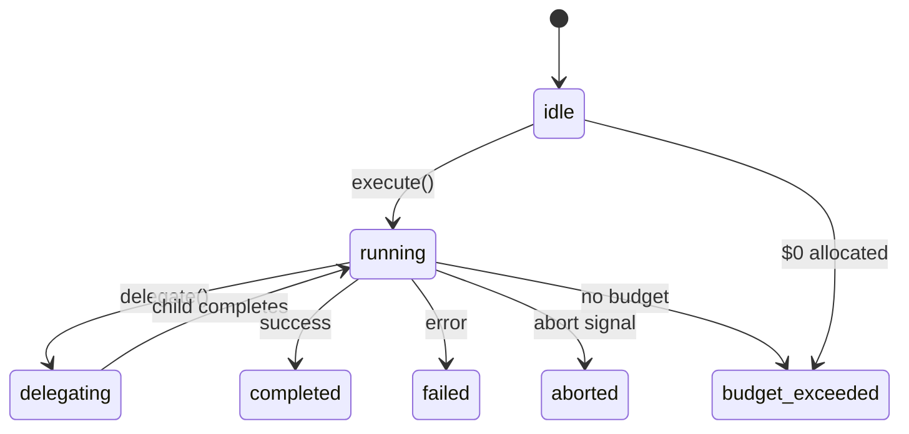
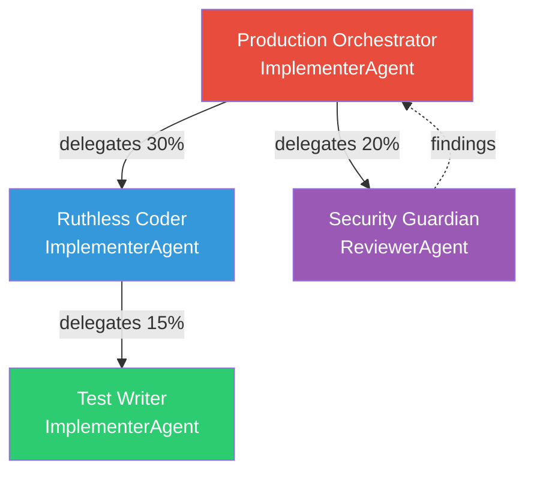

# Architecture

SkillFoundry is a CLI framework that orchestrates AI agents through a governed pipeline. It ships with 88 agent prompt files, a 7-tier quality gate system, a JSONL-based memory system, and local-first telemetry. This page explains how each component works and how they connect.

## System Overview

The framework consists of eight core subsystems:

| Subsystem | Purpose | Key Files |
|-----------|---------|-----------|
| **Pipeline Engine** | Orchestrates the 8-phase Forge pipeline | `src/core/pipeline.ts` |
| **Agent System** | Base class, 4 archetypes, delegation, budget control | `src/core/agent.ts` |
| **Quality Gates** | T0-T7 verification tiers + micro-gates | `src/core/gates.ts`, `src/core/micro-gates.ts` |
| **Memory System** | JSONL knowledge bank with layered recall | `src/core/memory.ts`, `src/core/layered-recall.ts` |
| **Session Recorder** | Structured issue tracking and run reports | `src/core/session-recorder.ts` |
| **Runtime Intelligence** | Message bus, agent pool, embedding service, vector store, weight learner | `src/core/message-bus.ts`, `src/core/agent-pool.ts`, `src/core/embedding-service.ts`, `src/core/vector-store.ts`, `src/core/weight-learner.ts` |
| **Security Scanners** | Gitleaks secret detection, Checkov IaC scanning, semantic search | `src/core/gitleaks-scanner.ts`, `src/core/checkov-scanner.ts`, `src/core/semantic-search.ts` |
| **Reporting** | Dependency scanning, report generation, PRD scoring | `src/core/dependency-scanner.ts`, `src/core/report-generator.ts`, `src/core/prd-scorer.ts` |

Supporting modules handle configuration (`config.ts`), credential management (`credentials.ts`), output compression (`output-compressor.ts`), intent classification (`intent.ts`), and provider abstraction for multiple LLM backends (`provider.ts`).

## The Forge Pipeline

The pipeline is the core execution engine. It takes PRDs from `genesis/`, decomposes them into stories, executes each story with AI agents, and validates the output through quality gates.

### Pipeline Flow

```mermaid
flowchart LR
    A[genesis/ PRDs] --> B[IGNITE]
    B --> C[PLAN]
    C --> D[FORGE]
    D --> E[POLISH]
    E --> F[TEMPER]
    F --> G[INSPECT]
    G --> H[DEBRIEF]
    H --> I[FINISH]

    style B fill:#e74c3c,color:#fff
    style C fill:#e67e22,color:#fff
    style D fill:#f39c12,color:#fff
    style E fill:#2ecc71,color:#fff
    style F fill:#3498db,color:#fff
    style G fill:#9b59b6,color:#fff
    style H fill:#1abc9c,color:#fff
    style I fill:#34495e,color:#fff
```



### Phase Breakdown

| Phase | What Happens | Failure Behavior |
|-------|-------------|-----------------|
| **IGNITE** | Discovers PRDs in `genesis/`, validates quality gates (problem statement, acceptance criteria, security requirements, no TBD markers) | Pipeline aborts if PRD validation fails |
| **PLAN** | Decomposes each PRD into self-contained stories with dependency ordering. Stories are written to `docs/stories/` | Pipeline aborts if decomposition fails |
| **FORGE** | Executes stories sequentially. Each story gets an AI agent with tool access (file read/write, bash, glob, grep). Micro-gates run after each story | Circuit breaker halts after 2 consecutive same-error failures |
| **POLISH** | Runs micro-gates: MG0 (acceptance criteria validation), MG1 (security review), MG1.5 (test documentation), MG2 (standards review), MG3 (cross-story advisory) | Findings reported; FAIL findings trigger fixer agent |
| **TEMPER** | Runs the full T0-T7 quality gate suite against the working directory | Gate failures trigger up to 2 automated fix attempts |
| **INSPECT** | Deep security scan using Semgrep with OWASP rulesets (when available), falls back to regex pattern matching | Findings reported in run summary |
| **DEBRIEF** | Generates JSON and Markdown run reports in `.skillfoundry/runs/<run-id>/` | Always runs |
| **FINISH** | Harvests lessons learned (decisions, errors, patterns) into `memory_bank/knowledge/` as JSONL entries | Always runs |

### Circuit Breaker

The pipeline includes a circuit breaker to prevent infinite remediation loops. If 2 consecutive story executions fail with the same error (measured by 60% word overlap), the pipeline halts and reports a `CIRCUIT_BREAKER` issue rather than burning through budget on a systemic problem.

## Agent Architecture

SkillFoundry uses a real autonomous agent system built on a base `Agent` class with a state machine, event emitter, delegation protocol, and budget partitioning.

### Agent State Machine

Every agent transitions through these states:



### Four Archetypes

All agents inherit from the `Agent` base class and specialize into one of four archetypes:

| Archetype | Class | Tool Access | Purpose |
|-----------|-------|-------------|---------|
| **Implementer** | `ImplementerAgent` | Full (read, write, bash, glob, grep) | Writes code, runs commands, produces artifacts |
| **Reviewer** | `ReviewerAgent` | Read-only (read, glob, grep) | Analyzes code, reports findings with file paths and line numbers. Never modifies files |
| **Operator** | `OperatorAgent` | Diagnostics (bash, read, glob) | Runs diagnostics, health checks, produces reports. Does not modify source files |
| **Advisor** | `AdvisorAgent` | None | Answers questions using context only. No file system access |

### Delegation Protocol

Agents can delegate subtasks to child agents. The delegation system enforces:

- **Budget partitioning** — Parent allocates a fraction of its remaining budget to the child (default: 30%)
- **Depth limiting** — Maximum delegation depth of 3 to prevent runaway chains
- **Event forwarding** — Parent's event listeners are forwarded to child agents
- **Artifact merging** — Child artifacts are merged into the parent's artifact list
- **Abort propagation** — Abort signals propagate through the delegation chain



### Agent Prompt System

The 88 agent prompt files in `agents/` are Markdown documents with YAML frontmatter. At runtime, the `agent-prompt-loader.ts` module reads these files and injects them as system prompts. If a file cannot be loaded, the system falls back to a hardcoded one-liner from the agent registry.

Agent prompts include protocols for:
- Context discipline and scope boundaries
- Error handling and recovery
- Commit message conventions
- Gate verification procedures
- Deliberation and dissent resolution
- Environment pre-flight auditing (interpreter detection, dependency verification, diagnostic discipline)

## Quality Gates (T0-T7)

The gate system runs 8 tiers of automated verification. Each tier is independent and produces a PASS, WARN, or FAIL verdict with structured findings.

| Tier | Name | What It Checks | Tools Used |
|------|------|---------------|------------|
| **T0** | Correctness Contract | Every `done_when` acceptance criterion has a corresponding test. Maps criteria to test files | Git diff analysis, test file pattern matching |
| **T1** | Banned Patterns & Syntax | Scans for banned patterns: `TODO`, `FIXME`, `PLACEHOLDER`, `NotImplementedError`, empty function bodies, `@ts-ignore` without justification | `anvil.sh` or inline regex scanner |
| **T2** | Type Check | Runs the project's type checker: `tsc --noEmit` (TypeScript), `pyright` (Python), `dotnet build` (.NET) | Detected build system |
| **T3** | Tests | Runs the test suite AND verifies test files exist for completed stories. Checks test output for failures | `vitest`, `pytest`, `dotnet test`, `go test` |
| **T4** | Security (Semgrep OWASP) | Semgrep-first with OWASP rulesets (`p/owasp-top-ten`), falls back to regex pattern scanning for hardcoded secrets, SQL injection, XSS vectors | Semgrep CLI or regex fallback |
| **T5** | Build Verification | Runs the project's build command to verify compilation succeeds | `npm run build`, `cargo build`, `dotnet build` |
| **T6** | Scope Validation | Verifies that code changes stay within the scope defined by the PRD. Detects unauthorized modifications to unrelated files | `anvil.sh scope` or git diff analysis |
| **T7** | Deploy Pre-Flight | Validates deployment readiness: DB migration state (Alembic/Prisma/EF/Rails), CORS origin consistency, env variable presence, frontend API URL hardcoding, page_size contract violations, endpoint smoke tests | `alembic`, `prisma`, `curl`, env file parsing |

### Gate Execution Flow

Gates run during the TEMPER phase. If any gate fails:

1. Findings are formatted and sent to a **fixer agent** (ImplementerAgent)
2. The fixer attempts to resolve the issues (max 2 attempts)
3. Gates re-run after each fix
4. If all fix attempts fail, the pipeline reports the failure and continues to DEBRIEF

### Micro-Gates

In addition to T0-T7, the pipeline runs lightweight AI-powered micro-gates after each story during the POLISH phase:

| Gate | Name | Timing | Purpose |
|------|------|--------|---------|
| **MG0** | AC Validation | Pre-generation | Ensures acceptance criteria are objectively verifiable — no subjective language |
| **MG1** | Security Review | Post-story | Reviews the story's diff for security issues |
| **MG1.5** | Test Documentation | Post-story | Verifies tests have intent documentation (GIVEN/WHEN/THEN, WHY comments) |
| **MG2** | Standards Review | Post-story | Checks code against project standards |
| **MG3** | Cross-Story Advisory | Pre-TEMPER | Reviews interactions between completed stories |

Micro-gates are single-turn AI reviews (1-3 turns max) that catch issues early before they compound.

## Memory System

The memory system provides cross-session learning through a JSONL knowledge bank stored in `memory_bank/knowledge/`.

### Entry Structure

Each knowledge entry is a JSON line with:

```json
{
  "id": "uuid",
  "type": "fact | decision | error | pattern | preference | lesson",
  "content": "What was learned",
  "tags": ["auth", "security"],
  "source": "pipeline-run-id",
  "created_at": "2026-03-16T10:30:00Z",
  "project": "my-project",
  "confidence": 0.85
}
```

### Entry Types

| Type | When Created | Example |
|------|-------------|---------|
| `fact` | During exploration | "Project uses Vitest for testing" |
| `decision` | During implementation | "Chose JWT RS256 over HS256 for auth tokens" |
| `error` | During gate failures | "T3 failed: missing test for /api/users endpoint" |
| `pattern` | After repeated observations | "TypeScript projects in this repo always use strict mode" |
| `preference` | From user corrections | "User prefers functional components over class components" |
| `lesson` | End-of-pipeline harvest | "Semgrep catches hardcoded secrets that regex misses" |

### Layered Recall

The recall system uses three progressive disclosure modes to manage context window usage:

| Mode | Detail Level | Use Case |
|------|-------------|----------|
| **Index** | 60-char snippets | Quick scan of available knowledge |
| **Preview** | 200-char summaries | Decide which entries are relevant |
| **Full** | Complete entries | Load specific knowledge into context |

Recall supports filtering by type, minimum weight, date range, and tags. Scoring uses TF-IDF to rank entries by relevance to the current query.

### Knowledge Harvesting

At the end of each pipeline run (FINISH phase), the `memory-harvest.ts` module extracts lessons from:

- Agent decisions made during story execution
- Gate failures and their resolutions
- Patterns observed across multiple stories
- User corrections from interactive sessions

Entries accumulate across sessions. Weight scores adjust over time — knowledge that proves useful in future runs gains weight, while stale entries decay.

## Telemetry

SkillFoundry uses local-first event logging. All telemetry data stays on disk in `.skillfoundry/runs/`.

### What Gets Recorded

| Data | Location | Format |
|------|----------|--------|
| Pipeline run metadata | `.skillfoundry/runs/<id>/run.json` | JSON |
| Human-readable report | `.skillfoundry/runs/<id>/report.md` | Markdown |
| Gate findings | `.skillfoundry/runs/<id>/gates.json` | JSON |
| Session issues | `.skillfoundry/runs/<id>/issues.json` | JSON |
| Token usage and cost | Embedded in `run.json` | JSON |

### Privacy-First Design

- No data is sent to external servers
- All telemetry is file-based and stays in the project directory
- API keys are managed through `credentials.ts` with secure storage
- The `redact.ts` module strips sensitive data from logs and reports
- Output compression (`output-compressor.ts`) reduces token usage by 60-90% without losing signal

## Platform Distribution

SkillFoundry agent prompts are distributed across 5 AI coding platforms. Each platform uses the same 88 agent prompt files, adapted to the platform's configuration format:

| Platform | Integration Method | Configuration |
|----------|-------------------|---------------|
| **Claude Code** | Slash commands in `.claude/commands/` | Markdown files with YAML frontmatter |
| **GitHub Copilot** | Custom instructions in `.github/copilot-instructions.md` | Converted via `convert-to-copilot.sh` |
| **Cursor** | Rules in `.cursor/rules/` | `.mdc` files with frontmatter |
| **OpenAI Codex** | Agent prompts in `.codex/` | Markdown instruction files |
| **Google Gemini** | Gemini CLI configuration | Provider adapter in `src/core/providers/gemini.ts` |

The `sf_cli` is the canonical source of truth. Platform-specific files are generated from the same agent prompts to prevent drift.

## VS Code Extension

The `skillfoundry-vscode` extension provides IDE integration:

- **Sidebar panel** for viewing pipeline status, gate results, and memory entries
- **Command palette** commands for running forge, checking gates, and managing PRDs
- **Inline diagnostics** that surface gate findings as editor warnings
- **Status bar** showing current run state and cost

The extension communicates with the CLI through the same configuration and run output files — it reads `.skillfoundry/` rather than running a separate backend.

## Next Steps

- **[Getting Started](/getting-started)** — Install and run your first pipeline
- **[Configuration](/configuration)** — Customize gates, thresholds, providers, and agent behavior
- **[Recipes](/recipes/nextjs)** — Framework-specific setup guides
